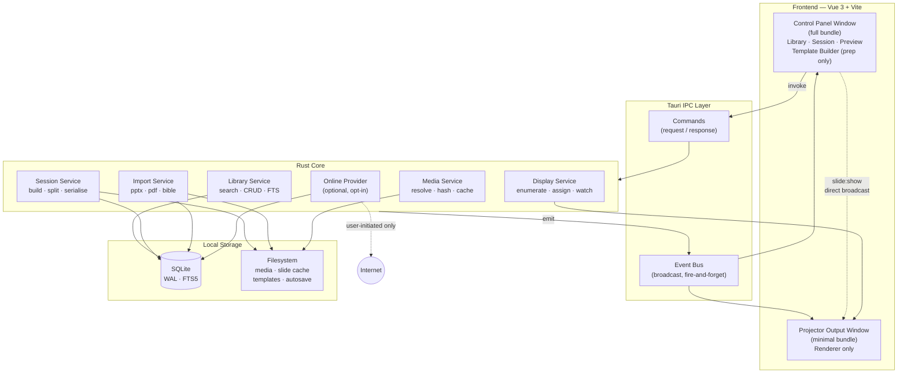
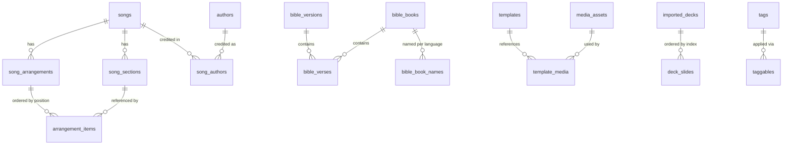
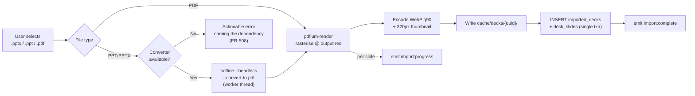

# AeroWorship — Product Requirements Document

| Field | Value |
| --- | --- |
| **Product** | AeroWorship |
| **Document version** | 1.0 (MVP) |
| **Status** | Draft for approval |
| **Last updated** | 2026-08-07 |
| **Owner** | Product Management / System Architecture |
| **Target release** | MVP v0.1 |
| **Platforms** | Windows 10+ (primary), macOS 12+, Linux (Ubuntu 22.04+) |

---

## Table of Contents

1. [Executive Summary](#1-executive-summary)
2. [User Personas](#2-user-personas)
3. [User Stories](#3-user-stories)
4. [Functional Requirements](#4-functional-requirements)
5. [Non-Functional Requirements](#5-non-functional-requirements)
6. [Technical Architecture Overview](#6-technical-architecture-overview)
7. [Success Metrics](#7-success-metrics)
8. [Risks, Assumptions & Open Decisions](#8-risks-assumptions--open-decisions)
9. [Release Plan](#9-release-plan)
- [Appendix A — SQLite Schema (DDL)](#appendix-a--sqlite-schema-ddl)
- [Appendix B — Template JSON Schema](#appendix-b--template-json-schema)
- [Appendix C — `.aero` Session File Schema](#appendix-c--aero-session-file-schema)
- [Appendix D — Tauri Command & Event Reference](#appendix-d--tauri-command--event-reference)
- [Appendix E — Keyboard Shortcut Map](#appendix-e--keyboard-shortcut-map)
- [Appendix F — Glossary](#appendix-f--glossary)

---

## 1. Executive Summary

### 1.1 Problem Statement

Church presentation software is operated, in the overwhelming majority of congregations, by **unpaid volunteers on donated hardware**. Three structural problems follow from that reality, and every incumbent product handles at least one of them badly:

1. **Weight.** The dominant tools in this category are built as full media production suites. They routinely idle at 400–900 MB of RAM and take 15–40 seconds to cold start. On the 4 GB dual-core machine that a church actually has in its projection booth, this produces stuttering slide transitions and occasional mid-service freezes — the single most visible failure mode a congregation can witness.
2. **Connectivity assumptions.** Increasingly, competitors move libraries, licensing checks, and media to the cloud. Many venues have no reliable internet in the sanctuary. Software that degrades when offline is software that fails precisely when it is being used.
3. **Cognitive load during live operation.** Editing tools, media browsers, and design panels remain on screen while the service is running. A volunteer who has practiced twice is one mis-click away from putting a text editor on the projector.

### 1.2 Product Vision

> AeroWorship is a desktop church presentation application that starts instantly, runs entirely offline, stays under 100 MB of memory, and puts exactly one thing in front of the operator during a live service: the next slide.

We are not competing on feature count. We are competing on **the confidence of the person holding the keyboard at 09:58 on a Sunday morning.**

### 1.3 Strategic Differentiators

| # | Differentiator | How it is realised | Why it defends |
| --- | --- | --- | --- |
| D1 | **Lightweight by construction** | Tauri (system webview, no bundled Chromium) + Rust core. Templates are declarative JSON, not live-rendered design documents. Imported presentations become flat image sequences. | Cannot be copied by an Electron-based incumbent without a rewrite. |
| D2 | **Offline-first, not offline-capable** | Local SQLite is the source of truth. Network access is an optional enhancement on exactly one feature (online lyric search) and is never on the critical path. | Directly addresses the venue-connectivity failure mode. |
| D3 | **Mode separation** | Design and preparation tools exist in Preparation Mode. Live Mode has no editing affordances at all. | Reduces operator error; the primary driver of the SUS > 75 target. |
| D4 | **Portable service plans** | The `.aero` session file is a small, human-readable JSON document that travels from a volunteer's laptop to the booth machine. | Enables the real workflow: prepare at home, present at church. |

### 1.4 MVP Scope

| Ref | Capability | Priority |
| --- | --- | --- |
| F1 | Dual-monitor system — automatic detection, separate Control Panel and Projector Output windows | Must |
| F2 | Library management — songs and Bible, instant local search | Must |
| F3 | JSON-based Template Builder — backgrounds, SVG shapes/frames, text slots | Must |
| F4 | PowerPoint (PPT/PPTX) import → high-resolution image sequence | Must |
| F5 | Online lyric search as progressive enhancement, persisted to SQLite | Should |
| F6 | `.aero` session file export/import | Must |
| F7 | Blank-session drag-and-drop workflow | Must |
| F8 | Live Mode / Preparation Mode separation | Must |

### 1.5 Explicitly Out of Scope for MVP

Stating the cut-line matters more than stating the scope, because scope creep in this category is what produced the heavyweight incumbents in the first place.

| Excluded | Rationale | Revisit |
| --- | --- | --- |
| Live video playback, camera input, NDI/SDI output | Directly contradicts the memory and latency budget | v2.0 |
| Stage/confidence display (third output) | Adds a third webview; blows the RAM budget | v1.1 |
| Lower-thirds, alpha-keyed broadcast output | Different product | Not planned |
| Cloud sync, multi-device library sharing | Contradicts D2 | v2.0 |
| CCLI usage reporting integration | Requires licensing partnership | v1.2 |
| Multi-language / bilingual simultaneous slide rendering | Meaningful design work; deserves its own spec | v1.1 |
| Audio playback and click tracks | Out of category for MVP | v2.0 |
| Native `.pptx` editing (we import, we do not edit) | See [R1](#81-risk-register) | Not planned |
| Automatic software updates | Ship manual download for MVP | v1.1 |

### 1.6 Success Definition (Summary)

The MVP is successful when a volunteer operator who has never seen the software can, after a five-minute walkthrough, build and run a complete Sunday service without assistance, on a 4 GB machine, with no internet connection — and rate the experience above 75 on the System Usability Scale. Full metric definitions in [Section 7](#7-success-metrics).

---

## 2. User Personas

Four personas drive the design. Each one is included because it forces a specific architectural or interaction decision; personas that do not change the product are not listed.

### 2.1 P1 — Budi, the Volunteer Operator *(primary persona)*

| Attribute | Detail |
| --- | --- |
| **Age / role** | 19, university student, serves on the multimedia rota once every three weeks |
| **Technical proficiency** | Comfortable with a phone, moderate with a laptop. Has never used professional presentation software outside this room. |
| **Hardware** | The church's booth PC: Intel i3 (8th gen), 4 GB RAM, integrated graphics, Windows 10, HDMI to a 1080p projector |
| **Context of use** | Standing/seated in a booth at the back. Low light. Service is live. A worship leader may change the song order verbally, mid-service. |
| **Goals** | Never be the reason the congregation sees the wrong thing. Advance slides in time with the music. Find a Bible verse the preacher calls out spontaneously, within seconds. |
| **Frustrations** | Software that freezes on transition. Menus that expose destructive actions during a service. Having to remember which panel is the projector. |
| **Design implications** | → Live Mode must contain **zero** editing affordances (F8, [FR-301](#43-fr-3xx--session--live-presentation)). <br> → Slide advance must be keyboard-first and sub-100 ms ([NFR-02](#51-performance)). <br> → Ad-hoc Bible lookup must be reachable without leaving Live Mode ([FR-205](#42-fr-2xx--library-management)). <br> → The application must not exceed the machine's headroom ([NFR-01](#51-performance)). |

### 2.2 P2 — Ibu Sari, the Worship Leader / Preparer

| Attribute | Detail |
| --- | --- |
| **Age / role** | 34, leads the worship team, plans the service on Thursday evening |
| **Technical proficiency** | Competent office-software user. Builds the song list in a spreadsheet today. |
| **Hardware** | Personal laptop at home, decent spec, has internet |
| **Context of use** | Kitchen table, Thursday, 21:00. Wants to hand a finished plan to whoever is on the rota Sunday. |
| **Goals** | Assemble the full service order once, at home. Add a new song she heard this week. Be confident the plan opens correctly on the church machine. |
| **Frustrations** | Having to rebuild the order at church. Typing lyrics manually. Discovering on Sunday that a background image did not travel with the file. |
| **Design implications** | → The session must be a portable file, not a database row ([FR-701](#47-fr-7xx--aero-session-files)). <br> → Missing-media resolution must be explicit and fixable, not a silent blank slide ([FR-704](#47-fr-7xx--aero-session-files)). <br> → Online lyric search exists for her Thursday-night context, and only for it ([FR-601](#46-fr-6xx--online-lyric-search)). <br> → The application opens to an **empty** session so that building an order is the obvious first action ([FR-301](#43-fr-3xx--session--live-presentation)). |

### 2.3 P3 — Rio, the Media & Design Volunteer

| Attribute | Detail |
| --- | --- |
| **Age / role** | 26, graphic designer by trade, maintains the church's visual identity |
| **Technical proficiency** | High. Uses Figma/Illustrator daily. |
| **Context of use** | Once a season, prepares a themed template set for a sermon series. Never operates during the service. |
| **Goals** | Make lyrics legible against a photographic background. Apply the church's typographic identity consistently. Produce something a non-designer cannot accidentally break. |
| **Frustrations** | Presentation tools with a "design mode" that is really just a text box editor. Templates that look right at 1080p and break at 1280×800. |
| **Design implications** | → Template Builder needs an SVG shape/frame layer for text scrims and lower-panel treatments ([FR-403](#44-fr-4xx--template-builder)). <br> → Coordinates stored in normalized 0–1 units so a template is resolution-independent ([§6.7](#67-template-model)). <br> → Templates are locked assets during Live Mode; the operator picks, never edits ([FR-408](#44-fr-4xx--template-builder)). |

### 2.4 P4 — Pak Yohanes, the IT Steward

| Attribute | Detail |
| --- | --- |
| **Age / role** | 52, church board member, the person who "knows computers" |
| **Technical proficiency** | Moderate. Installs software, manages the booth PC, has no budget. |
| **Context of use** | Installs once, then is called only when something breaks. |
| **Goals** | Software that installs without admin gymnastics, does not phone home, does not require a subscription, and does not need replacing when the PC does not get upgraded. |
| **Frustrations** | Per-seat licensing. Mandatory accounts. Installers over 500 MB. Telemetry he cannot explain to the board. |
| **Design implications** | → Installer size target < 15 MB ([NFR-16](#56-portability--footprint)). <br> → No account, no activation, no telemetry by default ([NFR-13](#55-security--privacy)). <br> → Data stored in a single, backup-able application-data directory ([§6.9](#69-filesystem-layout)). |

---

## 3. User Stories

Stories are grouped by epic. Each carries a stable ID, a MoSCoW priority, acceptance criteria in Given/When/Then form, and a trace to the functional requirements that implement it.

### Epic A — Session Building

**US-01** — *Blank session on launch* · **Must** · P1, P2
> As an operator, I want the Session panel to be empty when I open the application, so that I always start from a clean, unambiguous state and never inherit someone else's leftover order.

- **Given** the application is launched, **when** the main window renders, **then** the Session panel is empty and displays an inline hint describing the drag-and-drop action.
- **Given** a previous session was open when the app was last closed normally, **when** the app is launched, **then** that session is **not** auto-restored; it is offered as "Recent" only.
- *Traces to:* [FR-301](#43-fr-3xx--session--live-presentation), [FR-302](#43-fr-3xx--session--live-presentation)

**US-02** — *Drag from Library to Session* · **Must** · P1, P2
> As a preparer, I want to drag a song or Bible passage from the Library panel into the Session panel, so that I can assemble the service order by direct manipulation rather than through dialogs.

- **Given** a search result is visible in the Library panel, **when** I drag it over the Session panel, **then** an insertion indicator shows the drop position.
- **Given** I drop the item, **when** the drop completes, **then** the item appears at the indicated position within 50 ms and the Session is marked dirty.
- **Given** I drag an item that is already in the Session, **when** I drop it again, **then** a second independent instance is created (repeats are legitimate in a service order).
- *Traces to:* [FR-303](#43-fr-3xx--session--live-presentation)

**US-03** — *Reorder and remove* · **Must** · P1, P2
> As a preparer, I want to reorder or remove items in the Session, so that I can adapt to a changed service plan.

- **Given** the Session contains ≥ 2 items, **when** I drag an item to a new index, **then** the order updates and all subsequent items renumber.
- **Given** an item is selected, **when** I press `Delete`, **then** it is removed and an undo affordance appears for 8 seconds.
- *Traces to:* [FR-304](#43-fr-3xx--session--live-presentation)

**US-04** — *Per-item template override* · **Should** · P2, P3
> As a preparer, I want to assign a specific template to one item in the session, so that the sermon-series song can use the series artwork while the rest of the service uses the default.

- **Given** a session item is selected in Preparation Mode, **when** I choose a template from the template picker, **then** the item's preview re-renders with that template and the override is persisted in the `.aero` file.
- *Traces to:* [FR-305](#43-fr-3xx--session--live-presentation), [FR-408](#44-fr-4xx--template-builder)

### Epic B — Live Presentation

**US-05** — *Automatic dual-monitor setup* · **Must** · P1, P4
> As an operator, I want the projector output to appear on the projector automatically, so that I do not have to configure display settings before every service.

- **Given** two or more displays are connected at launch, **when** the app starts, **then** the Control Panel opens on the primary display and the Projector Output opens fullscreen on the secondary display, showing black.
- **Given** only one display is connected, **when** the app starts, **then** no fullscreen output window is created; a windowed preview is shown instead and the UI states that no projector is attached.
- *Traces to:* [FR-101](#41-fr-1xx--dual-monitor-system), [FR-102](#41-fr-1xx--dual-monitor-system), [FR-106](#41-fr-1xx--dual-monitor-system)

**US-06** — *Advance slides with sub-perceptual latency* · **Must** · P1
> As an operator, I want the projector to change the instant I press the key, so that lyrics stay in time with the music.

- **Given** an item is live, **when** I press `→` or `Space`, **then** the projected image changes within 100 ms measured from key event to projector paint.
- **Given** I hold the advance key, **when** repeat events fire, **then** no frames are dropped and no transition queue backs up.
- *Traces to:* [FR-306](#43-fr-3xx--session--live-presentation), [NFR-02](#51-performance)

**US-07** — *Panic controls* · **Must** · P1
> As an operator, I want a single key that blacks out the projector, so that I can recover instantly from any mistake.

- **Given** any state, **when** I press `B`, **then** the projector goes to black within 100 ms and the Control Panel shows a persistent "OUTPUT BLANKED" banner.
- **Given** output is blanked, **when** I press `B` again, **then** the previous content is restored.
- **Given** any state, **when** I press `L`, **then** the projector shows the configured church logo/idle image.
- *Traces to:* [FR-307](#43-fr-3xx--session--live-presentation)

**US-08** — *Clean live interface* · **Must** · P1
> As an operator, I want editing tools hidden while presenting, so that I cannot accidentally modify content during the service.

- **Given** the application is in Live Mode, **when** I inspect the interface, **then** no template editor, no library editor, and no destructive action is reachable through a visible control or keyboard shortcut.
- **Given** the application is in Live Mode, **when** I attempt to switch to Preparation Mode while an item is live, **then** I am asked to confirm.
- *Traces to:* [FR-308](#43-fr-3xx--session--live-presentation), [FR-309](#43-fr-3xx--session--live-presentation)

**US-09** — *Projector disconnect resilience* · **Must** · P1, P4
> As an operator, I want a cable knock not to crash the application, so that a hardware wobble does not end the service.

- **Given** an item is live, **when** the projector is disconnected, **then** the Control Panel remains fully responsive, the current slide state is preserved, and a non-modal warning appears.
- **Given** the projector is reconnected, **when** the display is detected, **then** the output window is restored fullscreen on it showing the same slide, without operator action.
- *Traces to:* [FR-104](#41-fr-1xx--dual-monitor-system), [NFR-08](#52-reliability--data-integrity)

### Epic C — Library

**US-10** — *Instant song search* · **Must** · P1, P2
> As an operator, I want song results to appear as I type, so that I can find a song called out from the platform without breaking the flow of the service.

- **Given** a library of 10,000 songs, **when** I type three or more characters, **then** ranked results render within 150 ms (p95).
- **Given** I type a phrase from the middle of a chorus, **when** the search runs, **then** matching songs are returned with the matching line highlighted.
- *Traces to:* [FR-201](#42-fr-2xx--library-management), [NFR-03](#51-performance)

**US-11** — *Scripture reference lookup* · **Must** · P1
> As an operator, I want to type a scripture reference directly, so that I can put up a verse the preacher names without navigating a book/chapter/verse tree.

- **Given** the search field, **when** I type `Yoh 3:16-18`, **then** the parser resolves the abbreviation, version, chapter and verse range, and shows the passage.
- **Given** an ambiguous or malformed reference, **when** parsing fails, **then** the app falls back to full-text search over verse content rather than showing an error.
- *Traces to:* [FR-205](#42-fr-2xx--library-management), [FR-206](#42-fr-2xx--library-management)

**US-12** — *Song sections and arrangement* · **Must** · P2
> As a preparer, I want to define a song's sections and the order they are sung in, so that "Verse 1, Chorus, Verse 2, Chorus, Chorus" does not require duplicating text.

- **Given** a song with labelled sections, **when** I define an arrangement, **then** the session expands the arrangement into the correct slide sequence with no duplicated stored text.
- *Traces to:* [FR-203](#42-fr-2xx--library-management), [FR-204](#42-fr-2xx--library-management)

**US-13** — *Multi-version Bible* · **Should** · P1, P2
> As a preparer, I want more than one Bible translation available, so that I can match the version the preacher is using.

- **Given** ≥ 2 installed versions, **when** I switch the active version on a scripture item, **then** the text updates while the reference stays fixed.
- *Traces to:* [FR-207](#42-fr-2xx--library-management)

### Epic D — Templates

**US-14** — *Build a template* · **Must** · P3
> As a design volunteer, I want to compose a background, a shape layer, and a text area, so that lyrics remain legible over photographic backgrounds.

- **Given** the Template Builder in Preparation Mode, **when** I add a background image, an SVG scrim shape, and a text slot, **then** the live preview reflects each change within 200 ms.
- **Given** a saved template, **when** it is inspected on disk, **then** it is a JSON document conforming to [Appendix B](#appendix-b--template-json-schema).
- *Traces to:* [FR-401](#44-fr-4xx--template-builder)–[FR-405](#44-fr-4xx--template-builder)

**US-15** — *Resolution independence* · **Must** · P3
> As a design volunteer, I want a template to look correct on any projector, so that I do not have to maintain one design per resolution.

- **Given** a template authored on a 1920×1080 canvas, **when** it is rendered on a 1280×800 output, **then** all layers retain their proportional position and the text scales with the canvas rather than reflowing unpredictably.
- *Traces to:* [FR-406](#44-fr-4xx--template-builder), [§6.7](#67-template-model)

**US-16** — *Overflow safety* · **Should** · P3, P1
> As a design volunteer, I want to know when text will not fit, so that the congregation never sees a clipped line.

- **Given** a text slot with fixed bounds, **when** content exceeds the slot at the minimum permitted font size, **then** the Builder flags it in Preparation Mode and the renderer splits the content across slides at runtime.
- *Traces to:* [FR-407](#44-fr-4xx--template-builder), [FR-310](#43-fr-3xx--session--live-presentation)

### Epic E — Import

**US-17** — *Import a PowerPoint deck* · **Must** · P2, P1
> As a preparer, I want to import an existing `.pptx`, so that the announcements deck someone else made can be shown inside the same service order.

- **Given** a `.pptx` file, **when** I import it, **then** conversion runs in the Rust backend without blocking the UI and reports progress per slide.
- **Given** conversion completes, **when** the deck appears in the Library, **then** each slide is a pre-rendered raster image at the target output resolution, and the original file is no longer required to present.
- **Given** conversion fails or the required converter is unavailable, **when** the error occurs, **then** the user is given a specific, actionable message ([R1](#81-risk-register)).
- *Traces to:* [FR-501](#45-fr-5xx--presentation-import)–[FR-506](#45-fr-5xx--presentation-import)

### Epic F — Online Enhancement

**US-18** — *Search lyrics online* · **Should** · P2
> As a preparer working at home, I want to search for a song's lyrics online and save it into my library, so that I do not have to type it by hand.

- **Given** an active internet connection, **when** I open the online search tab and query a title, **then** candidate results are listed with source attribution.
- **Given** no internet connection, **when** I open the Library, **then** the online tab is visibly disabled with an explanatory label — and **no** other feature is degraded or delayed.
- **Given** I import an online result, **when** the import completes, **then** the song is stored in local SQLite with its source URL and retrieval date, and is thereafter available fully offline.
- *Traces to:* [FR-601](#46-fr-6xx--online-lyric-search)–[FR-605](#46-fr-6xx--online-lyric-search)

### Epic G — Session Files

**US-19** — *Save a session to a file* · **Must** · P2
> As a preparer, I want to save my service order to a file, so that I can carry it to church on a flash drive.

- **Given** a session with items, **when** I choose Save, **then** an `.aero` file is written that is valid JSON, under 100 KB for a typical service, and conforms to [Appendix C](#appendix-c--aero-session-file-schema).
- *Traces to:* [FR-701](#47-fr-7xx--aero-session-files), [FR-702](#47-fr-7xx--aero-session-files)

**US-20** — *Open a session prepared elsewhere* · **Must** · P1, P2
> As an operator, I want to open the file the worship leader prepared, so that I do not rebuild the order on Sunday morning.

- **Given** an `.aero` file whose referenced songs exist in the local library, **when** I open it, **then** the session is restored completely and is immediately presentable.
- **Given** a referenced entity is missing locally, **when** I open the file, **then** the item is shown in a clearly-marked unresolved state with the stored human-readable title, and I am offered resolution actions — **the session still opens.**
- **Given** referenced media cannot be found at its stored path, **when** I open the file, **then** a relink dialog offers to search a chosen folder by content hash.
- *Traces to:* [FR-703](#47-fr-7xx--aero-session-files)–[FR-706](#47-fr-7xx--aero-session-files)

**US-21** — *Crash recovery* · **Should** · P1
> As an operator, I want my session to survive a power cut, so that I do not rebuild it under pressure.

- **Given** an unsaved session, **when** the process terminates abnormally, **then** on next launch the app offers to recover the autosaved state from within the last 30 seconds.
- *Traces to:* [FR-707](#47-fr-7xx--aero-session-files), [NFR-09](#52-reliability--data-integrity)

---

## 4. Functional Requirements

**Priority key:** M = Must (MVP blocker) · S = Should (MVP if schedule permits) · C = Could (post-MVP candidate).

### 4.1 FR-1xx — Dual-Monitor System

| ID | Requirement | Pri | Story | Acceptance Criteria |
| --- | --- | --- | --- | --- |
| FR-101 | Enumerate all connected displays at startup via the Rust backend, exposing id, name, resolution, scale factor, position, and primary flag. | M | US-05 | `list_monitors` returns one entry per OS-reported display; values match OS display settings. |
| FR-102 | Automatically open the Control Panel on the primary display and the Projector Output fullscreen, borderless, on the first non-primary display. | M | US-05 | With 2 displays connected, both windows are correctly placed with no user action. |
| FR-103 | Allow the user to manually reassign the output display, with the choice persisted per machine. | M | US-05 | Reassignment takes effect within 500 ms and survives restart. |
| FR-104 | Detect display connect/disconnect at runtime and emit `monitor:changed`. On disconnect of the output display, preserve slide state and keep the Control Panel responsive; on reconnect, restore output automatically. | M | US-09 | Disconnect/reconnect cycle during live presentation causes no crash, no state loss, and no operator action. |
| FR-105 | The Projector Output window shall have no chrome, no title bar, no scrollbars, no context menu, no text selection, and no dev-tools access in release builds. | M | US-08 | Right-click, `Ctrl+A`, and `F12` produce no effect on the output window. |
| FR-106 | Single-display fallback: do not create a fullscreen output. Provide a resizable windowed preview and state clearly that no projector is attached. | M | US-05 | On a single-display machine the app is fully usable for preparation. |
| FR-107 | Output window states: `content`, `black`, `logo`, `clear` (template background with no text). Each is independently addressable. | M | US-07 | Each state is reachable by shortcut and by on-screen control; current state is always visible on the Control Panel. |
| FR-108 | Correctly handle mixed DPI scaling: the output renders at the output display's native pixel resolution regardless of the Control Panel display's scale factor. | S | US-15 | A 1080p projector receives 1920×1080 content when the control display is at 150% scaling. |
| FR-109 | The output window is always-on-top **only** over its own display and must not steal focus from the Control Panel. | M | US-06 | Keyboard focus remains with the Control Panel at all times after startup. |

### 4.2 FR-2xx — Library Management

| ID | Requirement | Pri | Story | Acceptance Criteria |
| --- | --- | --- | --- | --- |
| FR-201 | Full-text incremental search across song titles, authors, and lyric content, executed locally against SQLite FTS5. | M | US-10 | p95 latency < 150 ms on a 10,000-song corpus; results update on each keystroke after the 3rd character with 120 ms debounce. |
| FR-202 | Create, read, update, delete songs, including title, alternate title, author(s), CCLI number, copyright line, key, tempo, and tags. | M | US-12 | All fields round-trip through save/reload; deletion is soft with a 30-day recovery window. |
| FR-203 | Songs are stored as an ordered set of labelled **sections** (Verse 1, Chorus, Bridge, Tag, …), not as a single text blob. | M | US-12 | A section's text is stored exactly once regardless of how many times it is sung. |
| FR-204 | Songs support named **arrangements**: an ordered sequence of references to that song's sections. A default arrangement is generated on creation. | M | US-12 | Selecting an arrangement expands to the correct slide sequence; editing a section's text updates every occurrence. |
| FR-205 | Parse scripture references from free text, supporting book full names and common abbreviations in Indonesian and English, chapter:verse, verse ranges, and cross-chapter ranges. | M | US-11 | `Yoh 3:16`, `John 3:16-18`, `Kej 1:1-2:3`, `Mzm 23` all resolve correctly. |
| FR-206 | When reference parsing fails, silently fall back to full-text search over verse text. | M | US-11 | Typing `kasih karunia` returns verses containing that phrase; no error state is shown. |
| FR-207 | Support multiple installed Bible versions; allow switching the version of a scripture item without changing its reference. | S | US-13 | Version switch preserves book/chapter/verse and re-renders text. |
| FR-208 | Import Bible versions from a documented interchange format (see [§6.6](#66-data-model)); ship at least one public-domain version. | M | US-13 | A full 31,102-verse Bible imports in under 60 seconds and passes a verse-count integrity check. |
| FR-209 | Tag and filter library items; tags are shared across content types. | C | — | Filtering by a tag narrows results across songs and decks. |
| FR-210 | Media assets (images, static backgrounds) are registered in the library with dimensions, file size, and content hash. | M | US-14 | An image added once can be referenced by any number of templates and sessions. |
| FR-211 | Library search results indicate content type with a distinct, colour-independent marker. | S | US-10 | Type is distinguishable in greyscale (accessibility). |

### 4.3 FR-3xx — Session & Live Presentation

| ID | Requirement | Pri | Story | Acceptance Criteria |
| --- | --- | --- | --- | --- |
| FR-301 | The application opens with an empty Session panel and an inline instructional hint. No session is auto-loaded. | M | US-01 | Verified on a machine with prior session history. |
| FR-302 | Offer a "Recent sessions" list as an explicit, opt-in action. | S | US-01 | Up to 10 recent `.aero` paths listed; stale paths marked unavailable. |
| FR-303 | Drag and drop from the Library panel into the Session panel, with a visible insertion indicator and support for dropping between existing items. | M | US-02 | Drop-to-render completes within 50 ms; duplicates are permitted. |
| FR-304 | Reorder by drag; remove by `Delete` or context action, with an 8-second undo. | M | US-03 | Order and numbering update atomically. |
| FR-305 | Per-item template override, falling back to the content-type default, falling back to the global default. | S | US-04 | Override persists in the `.aero` file and survives round-trip. |
| FR-306 | Slide navigation: next, previous, first, last, and jump-to-index — all keyboard-driven and all reflected on the projector within the latency budget. | M | US-06 | See [NFR-02](#51-performance). |
| FR-307 | Panic controls: blank (`B`), logo (`L`), clear (`C`), each toggling and each reflected in a persistent Control Panel status indicator. | M | US-07 | State change ≤ 100 ms; indicator is unmissable at a glance in low light. |
| FR-308 | Two explicit application modes. **Preparation Mode** exposes Template Builder, library editing, and import. **Live Mode** exposes only: session list, slide grid, preview, next/previous, and panic controls. | M | US-08 | No editing action is reachable in Live Mode by control, menu, or shortcut. |
| FR-309 | Switching from Live to Preparation Mode while content is live requires explicit confirmation. | M | US-08 | Confirmation dialog appears; cancelling leaves the presentation untouched. |
| FR-310 | Automatic slide splitting: content exceeding its text slot is split at line boundaries into multiple slides, deterministically and identically in preview and output. | M | US-16 | A 12-line verse against a 4-line slot produces 3 slides in both preview and output, with identical breaks. |
| FR-311 | The Control Panel shows a **preview** of the current slide and a **next-slide** preview simultaneously. | S | US-06 | Both previews are visible without scrolling at 1366×768. |
| FR-312 | A session item may be a song, a scripture passage, an imported deck, a media image, or an explicit blank/placeholder marker. | M | US-02 | All five types render in the session list with correct icons and slide counts. |
| FR-313 | Live navigation continues across item boundaries: advancing past the last slide of an item moves to the first slide of the next item. | M | US-06 | No dead-end at item boundaries; crossing a boundary respects the same latency budget. |

### 4.4 FR-4xx — Template Builder

| ID | Requirement | Pri | Story | Acceptance Criteria |
| --- | --- | --- | --- | --- |
| FR-401 | Templates are authored and stored as declarative JSON conforming to a versioned schema. No executable code is permitted in a template. | M | US-14 | A saved template validates against [Appendix B](#appendix-b--template-json-schema); a template containing a script node is rejected on load. |
| FR-402 | Background layer supporting solid colour, linear gradient, or image (with fit modes: cover, contain, stretch, tile). | M | US-14 | Each mode renders correctly at 16:9 and 16:10. |
| FR-403 | Shape layer supporting rectangles, rounded rectangles, and arbitrary SVG paths, with fill, opacity, stroke, and blur — used for text scrims and decorative frames. | M | US-14 | An SVG path pasted from a design tool renders identically to its source. |
| FR-404 | Text slot layer with a bound content role (`primary`, `secondary`, `reference`, `attribution`), font family, size range, weight, colour, alignment, line height, letter spacing, shadow, and outline. | M | US-14 | Changing the bound role changes which content the slot receives at render time. |
| FR-405 | Live preview updating within 200 ms of any property change, rendered with the same renderer used for output. | M | US-14 | Preview and output are pixel-identical for the same content and canvas size. |
| FR-406 | All geometry stored in normalized 0–1 coordinates relative to the canvas; the renderer maps them to the output's pixel dimensions at paint time. | M | US-15 | Same template on 1920×1080 and 1280×800 produces proportionally identical layout. |
| FR-407 | Safe-area guides and an overflow indicator warning when bound content cannot fit at the minimum font size. | S | US-16 | Warning appears in the Builder before the template is saved. |
| FR-408 | Template assignment: a global default plus a per-content-type default (song, scripture, media), overridable per session item. Templates are read-only in Live Mode. | M | US-04, US-08 | Resolution order is global → type → item; no template edit control exists in Live Mode. |
| FR-409 | Duplicate, rename, delete, export, and import templates as standalone `.aerotpl` JSON files. | S | US-14 | An exported template imports on another machine; missing referenced images trigger the relink flow. |
| FR-410 | Ship at least three built-in templates (high-contrast dark, photographic with scrim, plain light) that are not deletable. | M | — | Present on first launch with an empty user template folder. |

### 4.5 FR-5xx — Presentation Import

| ID | Requirement | Pri | Story | Acceptance Criteria |
| --- | --- | --- | --- | --- |
| FR-501 | Import `.ppt` and `.pptx` files via a file picker or drag-and-drop onto the Library. | M | US-17 | Both extensions accepted; unsupported files rejected with a clear message. |
| FR-502 | Conversion executes entirely in the Rust backend on a worker thread and must not block or stutter the UI. | M | US-17 | Frame timing on the Control Panel stays under 16.7 ms p95 during a conversion. |
| FR-503 | Each slide is rasterised to a static image at the configured output resolution (default 1920×1080), stored as WebP (quality 90) with a PNG fallback. | M | US-17 | A 30-slide deck produces 30 images; total cache size for a typical deck < 25 MB. |
| FR-504 | Emit `import:progress` events with slide index, total, and phase; the UI displays a determinate progress bar and allows cancellation. | M | US-17 | Cancelling mid-conversion leaves no partial deck in the library and no orphaned files. |
| FR-505 | Generate a thumbnail (320 px wide) per slide for the session grid. | M | US-17 | Thumbnails render in the grid without loading full-resolution images. |
| FR-506 | After import, the source file is not required for presentation. Record the source path, file hash, and import date for provenance and re-import. | M | US-17 | Presenting works after the source file is deleted or the flash drive removed. |
| FR-507 | Detect an out-of-date deck (source file hash changed) and offer re-import. | C | — | A changed source is flagged in the Library. |
| FR-508 | If the conversion toolchain is unavailable, present a specific, actionable error naming the missing dependency and the remedy — never a generic failure. | M | US-17 | See [R1](#81-risk-register). |
| FR-509 | Import PDF files through the same rasterisation path. | S | US-17 | A PDF imports and behaves identically to a converted deck. |

### 4.6 FR-6xx — Online Lyric Search

| ID | Requirement | Pri | Story | Acceptance Criteria |
| --- | --- | --- | --- | --- |
| FR-601 | Online search is presented as a clearly separate, secondary tab within the Library panel — never mixed into local results. | S | US-18 | Local and online results are never interleaved. |
| FR-602 | Connectivity is detected by an actual request to the configured provider, not by an OS "online" flag; the check is lazy and never blocks startup or local search. | S | US-18 | With the network cable pulled, app startup time is unchanged and local search is unaffected. |
| FR-603 | Providers are implemented behind a Rust trait so that additional sources can be added without touching the frontend. Requests carry a 5-second timeout and are cancellable. | S | US-18 | A hung provider cannot hang the UI. |
| FR-604 | Results are previewed before import; the user explicitly confirms, and may edit section labels during import. | S | US-18 | No online result is written to the database without confirmation. |
| FR-605 | Imported songs persist source URL, provider name, and retrieval timestamp; a CCLI number field is available for the user to complete. | S | US-18 | Fields are visible in the song's metadata panel. See [R3](#81-risk-register). |
| FR-606 | All network access is opt-in per query. The application makes no outbound request unless the user initiates an online search. | M | US-18 | Verified by packet capture on a clean launch and a full offline service run: zero outbound requests. |

### 4.7 FR-7xx — `.aero` Session Files

| ID | Requirement | Pri | Story | Acceptance Criteria |
| --- | --- | --- | --- | --- |
| FR-701 | Export the current session to a `.aero` file: UTF-8 JSON conforming to [Appendix C](#appendix-c--aero-session-file-schema), including a `schema_version`. | M | US-19 | Typical service file < 100 KB; file is human-readable and diff-friendly. |
| FR-702 | Library entities are referenced by stable UUID, accompanied by denormalized human-readable fallback fields (title, reference, author). | M | US-19, US-20 | Opening the file on a machine without the song shows the correct title in an unresolved state. |
| FR-703 | Import a `.aero` file, resolving each reference against the local library. Unresolvable items do not abort the load. | M | US-20 | A file with 8 items where 2 are unresolvable opens with 6 presentable and 2 marked. |
| FR-704 | Unresolved items offer explicit resolution actions: search the library, create from the embedded fallback text (if the exporter included it), or remove. | M | US-20 | Each action completes without reopening the file. |
| FR-705 | Media references store a path relative to the `.aero` file when possible, plus an absolute fallback and a BLAKE3 content hash. On failure to resolve, offer relink-by-hash across a user-chosen folder. | M | US-20 | Moving a session and its media folder together resolves with no prompt; moving only the session offers relink. |
| FR-706 | Optionally embed lyric text of referenced songs in the file ("portable export") for machines with an empty library, at the cost of file size. | S | US-20 | Portable export of a 6-song service stays under 200 KB and reconstitutes the songs on import. |
| FR-707 | Autosave the working session to the application data directory every 30 seconds and on every mutation; offer recovery after abnormal termination. | S | US-21 | Killing the process loses at most 30 seconds of work. |
| FR-708 | Reject files with an unknown future `schema_version` with an explicit "created by a newer version" message; migrate known older versions forward. | M | US-20 | Version handling is explicit, never a parse error. |
| FR-709 | Register the `.aero` file association on install so double-clicking opens the session. | C | US-20 | Double-click launches the app with the session loaded. |

---

## 5. Non-Functional Requirements

Every NFR states a **target** and the **method by which it is measured**. A target without a measurement method is not a requirement; it is an aspiration.

### 5.1 Performance

| ID | Requirement | Target | Measurement Method |
| --- | --- | --- | --- |
| NFR-01 | **Standby memory footprint.** Total resident set size of all AeroWorship-owned processes — the Rust host process, the Control Panel webview process, and the Projector Output webview process — with the application launched, an empty session, a 10,000-song library, and both windows open. | **≤ 100 MB** | Windows: sum of Private Working Set for the app process tree via `Get-Process` / PerfMon, sampled 60 s after launch, median of 5 runs on the reference machine. macOS: `footprint` command. Linux: sum of `PSS` from `/proc/*/smaps_rollup`. **Note:** WebView2/WKWebView host processes are counted; the OS-shared runtime binaries are not. This exclusion is stated because the number is meaningless without it. |
| NFR-02 | **Slide transition latency.** Time from operator input event to first painted frame of the new content on the projector. | **< 100 ms** (p95); target p50 < 50 ms | Instrumented build: `performance.now()` timestamp captured in the Control Panel keydown handler, carried in the `slide:show` event payload, compared against the projector's `requestAnimationFrame` callback after paint. 500 transitions on the reference machine, reported as p50/p95/p99. Cross-validated once with a 240 fps camera against the physical projector to confirm the software measurement is not optimistic. |
| NFR-03 | **Search response time.** Keystroke to rendered result list. | **< 150 ms** (p95) over 10,000 songs and 31,102 verses | Automated benchmark over a generated corpus, 200 queries of varying selectivity, measured end-to-end including IPC and render. |
| NFR-04 | **Cold start.** Process launch to interactive Control Panel. | **< 3 s** on the reference machine (HDD) / **< 1.5 s** (SSD) | Wall clock from process create to the frame in which the search field accepts input; median of 10 cold runs with caches cleared. |
| NFR-05 | **Idle CPU.** Application open, nothing live. | **< 1%** of one core | 5-minute sample, PerfMon / `top`. Requires no animation loops or polling timers at idle. |
| NFR-06 | **Live CPU.** During continuous slide advance. | **< 25%** of one core | Sampled during a scripted 50-slide run. |
| NFR-07 | **Import throughput.** PPTX conversion. | ≥ 1 slide/second at 1080p on the reference machine | 30-slide reference deck, timed, 3 runs. |

**Reference machine (all performance targets are stated against it):** Intel Core i3-8100, 4 GB DDR4, integrated UHD 630, 5400 rpm HDD, Windows 10 22H2, 1920×1080 primary + 1920×1080 secondary.

**Memory budget allocation** (informative — how NFR-01 is intended to be met):

| Component | Budget |
| --- | --- |
| Rust host process (incl. SQLite page cache, capped at 8 MB) | 22 MB |
| Control Panel webview | 45 MB |
| Projector Output webview (minimal bundle, no editor code) | 28 MB |
| Headroom | 5 MB |
| **Total** | **100 MB** |

Tactics that this budget assumes: the Projector Output window ships a separate, minimal Vite bundle containing only the renderer; library lists are virtualised; images are decoded at the output's native resolution and released when more than two items away from live; no source maps or dev tooling in release builds; slide image cache is on disk, not in memory, with an LRU of at most 3 decoded images.

### 5.2 Reliability & Data Integrity

| ID | Requirement | Target | Measurement Method |
| --- | --- | --- | --- |
| NFR-08 | **Output isolation.** A crash, hang, or render fault in the Projector Output window must never take down the Control Panel, and vice versa. | 100% | Fault injection: force-terminate the output webview during live presentation; Control Panel must remain responsive and offer to recreate the output. |
| NFR-09 | **Crash recovery.** Maximum work lost on abnormal termination. | ≤ 30 s | Kill the process at random points during a scripted 10-minute preparation; verify recovery offer and content. |
| NFR-10 | **Transactional import.** A cancelled or failed import leaves no partial rows and no orphaned files. | 100% | Cancel at 10 random points during conversion; verify database row count and cache directory are unchanged from pre-import. |
| NFR-11 | **Database durability.** SQLite in WAL mode with `synchronous = NORMAL`; no corruption under simulated power loss. | 0 corruptions in 50 trials | Hard-kill during write-heavy operations; run `PRAGMA integrity_check` after each. |
| NFR-12 | **Continuous operation.** No memory growth over a full service duration. | < 5% RSS growth over 2 hours of active use | 2-hour soak test with scripted navigation; RSS sampled every 30 s. |

### 5.3 Compatibility

| ID | Requirement | Target |
| --- | --- | --- |
| NFR-17 | Windows 10 (1809+) and Windows 11, x64. WebView2 runtime detected at install; bootstrapper offered if absent. | Primary — full support |
| NFR-18 | macOS 12+ (Apple Silicon and Intel), Ubuntu 22.04+ / Fedora 38+ with WebKitGTK 2.36+. | Secondary — supported, tested each release |
| NFR-19 | Minimum Control Panel resolution 1366×768 with no horizontal scrolling and no clipped controls. | Must |
| NFR-20 | Output resolutions 1280×720 through 3840×2160, aspect ratios 16:9, 16:10, and 4:3. | Must |
| NFR-21 | Functions correctly with per-monitor DPI scaling from 100% to 200%, including mixed-scale setups. | Must |

### 5.4 Usability

| ID | Requirement | Target | Measurement Method |
| --- | --- | --- | --- |
| NFR-22 | **System Usability Scale.** | **> 75** (mean) | Standard 10-item SUS administered to n ≥ 12 recruited volunteer operators immediately after a scripted service simulation. See [§7.3](#73-usability-evaluation-methodology). |
| NFR-23 | **User Experience Questionnaire.** | Efficiency, Perspicuity, and Dependability scales each **> 1.5** (above the "Good" benchmark threshold) | UEQ-S / full UEQ against the published benchmark dataset, same cohort and session as NFR-22. |
| NFR-24 | **Time to first slide.** A new operator, from application launch to first content on the projector, using a prepared `.aero` file. | ≤ 60 s unassisted; ≤ 3 primary interactions | Timed task in the usability study. |
| NFR-25 | **Live-mode error rate.** Unintended projector state changes during a scripted 20-minute simulated service. | ≤ 1 per session, none unrecoverable within 3 s | Observed and logged during the usability study. |
| NFR-26 | **Full keyboard operability.** Every live-presentation action is reachable without the mouse. | 100% of Live Mode actions | Keyboard-only walkthrough of the Live Mode action inventory. |
| NFR-27 | **Low-light legibility.** Control Panel usable in a darkened booth; dark theme is the default; status indicators legible at 2 m. | Pass/fail expert review | Heuristic review under 20 lux. |

### 5.5 Security & Privacy

| ID | Requirement | Target | Measurement Method |
| --- | --- | --- | --- |
| NFR-13 | **No telemetry.** The application collects and transmits no usage data, ever, with no opt-out required because there is no opt-in. | Zero outbound requests except user-initiated online search | Packet capture across a full launch → prepare → present → close cycle. |
| NFR-14 | **Minimal capability surface.** Tauri capabilities/allowlist grants only the filesystem scopes, dialog, window, and HTTP host permissions actually required. Remote content is never loaded into a webview. | Reviewed and justified per capability | Capability manifest reviewed at each release; CSP forbids remote script and inline script. |
| NFR-15 | **Path safety.** All filesystem paths originating from a `.aero` file, a template, or an import are canonicalised and validated against permitted roots before access. Directory traversal via `../` sequences is rejected. | 100% | Unit tests with hostile path fixtures; a crafted `.aero` file must not read outside its permitted roots. |
| NFR-28 | **Untrusted input hardening.** `.aero` files and templates are untrusted input: schema-validated before use, size-limited, and never `eval`-ed. Malformed input produces a diagnostic, never a crash. | 0 crashes | Fuzzing corpus of 10,000 mutated files. |
| NFR-29 | **No account, no activation, no licence server.** The application is fully functional without any identity. | Must | Functional verification on a machine with no network interface. |

### 5.6 Portability & Footprint

| ID | Requirement | Target | Measurement Method |
| --- | --- | --- | --- |
| NFR-16 | **Installer size.** Windows NSIS/MSI installer, excluding the WebView2 bootstrapper and excluding any optional external converter. | **< 15 MB** | Built artifact size at release. See [R1](#81-risk-register) for the tension with bundled conversion tooling. |
| NFR-30 | **Single data root.** All user data — database, media cache, templates, logs, autosave — lives under one application-data directory that can be copied to back up or migrate the installation. | Must | Copy the directory to a fresh machine; verify full state restoration. |
| NFR-31 | **No admin rights required** for normal operation; per-user install option available. | Must | Install and run as a standard user. |

### 5.7 Maintainability & Accessibility

| ID | Requirement | Target |
| --- | --- | --- |
| NFR-32 | Rust core logic (parsing, slide splitting, session serialisation, path resolution) covered by unit tests at ≥ 80% line coverage. | Must |
| NFR-33 | The Tauri command and event contract is defined once and shared with the frontend as generated TypeScript types; no hand-maintained duplicate definitions. | Must |
| NFR-34 | Structured logging to a rotating file in the data directory, with a one-click "export diagnostics" bundle. Logs contain no lyric or scripture content. | Should |
| NFR-35 | Control Panel meets WCAG 2.1 AA contrast (4.5:1 text, 3:1 UI components) in both themes; focus indicators are always visible; no information is conveyed by colour alone. | Must |
| NFR-36 | Projector output rendering is independent of the Control Panel theme. | Must |

---

## 6. Technical Architecture Overview

### 6.1 Architectural Principles

1. **The Rust core owns state; the webviews own pixels.** Any logic whose correctness matters (reference parsing, slide splitting, path resolution, serialisation) lives in Rust, is unit-tested, and is shared by both windows. The frontend renders and captures input.
2. **The hot path never crosses a process boundary synchronously.** Slide advance is an event broadcast, not a request/response. See [§6.5](#65-latency-strategy).
3. **Declarative over imperative rendering.** Templates are data. There is no scripting, no plugin execution, and no live layout engine in the output window beyond CSS and SVG.
4. **Precompute at import time, not at present time.** Presentations become images. Slide splits are computed when an item enters the session. Nothing expensive happens while the congregation is watching.
5. **The output window is minimal by construction.** It ships a separate bundle containing the renderer and nothing else — no editor, no library, no state management library. This is both a memory requirement and a safety property.

### 6.2 System Overview



### 6.3 Process & Window Model

| Window | Bundle | Responsibilities | State held |
| --- | --- | --- | --- |
| **Control Panel** | Full (`src/main`) | Library search UI, session construction, drag-and-drop, previews, Template Builder (Preparation Mode only), settings | The authoritative in-memory session, UI state, mode |
| **Projector Output** | Minimal (`src/output`) | Render exactly one slide, plus one preloaded hidden slide. Apply transitions. | Current slide, next slide, output state (`content`/`black`/`logo`/`clear`) — nothing else |

The output window is created and destroyed by the Rust `Display Service` in response to monitor topology, never by the frontend. It has no router, no store, no network access, and a CSP that forbids remote content and inline script.

**Why two webviews rather than one window spanning both displays:** a spanning window forces the OS to composite a single surface across two displays with potentially different refresh rates and scale factors, which is the classic source of tearing and of the "output is one frame behind" complaint. Two windows also give us the isolation property in [NFR-08](#52-reliability--data-integrity) for free. The cost is one additional webview process, which is accounted for in the memory budget in [§5.1](#51-performance).

### 6.4 Communication Contract

Two distinct mechanisms, chosen deliberately:

- **Commands** (`invoke`) — request/response, used for anything that reads or mutates persistent state: search, CRUD, import, save, load, monitor management. Always `async`, always returning a typed `Result`.
- **Events** (`emit` / `listen`) — one-way broadcast, used for anything real-time or multi-consumer: slide changes, output state, import progress, monitor topology changes.

The full catalogue with payload shapes is in [Appendix D](#appendix-d--tauri-command--event-reference). Types are defined once in Rust and generated into TypeScript at build time ([NFR-33](#57-maintainability--accessibility)), so the contract cannot drift.

**Event naming convention:** `domain:verb` — `slide:show`, `slide:preload`, `output:state`, `import:progress`, `monitor:changed`, `session:dirty`.

### 6.5 Latency Strategy

Meeting [NFR-02](#51-performance) (< 100 ms p95) is an architectural outcome, not an optimisation to be applied later. Four mechanisms, in order of contribution:

**1. Precomputed slides.** When a session item is added, the Rust `Session Service` immediately computes its full slide list — text split into slots, scripture chunked, deck images resolved. By the time anything is live, no content computation remains.

**2. Preload-ahead.** The output window holds two stacked layers: the visible slide and a hidden, fully-rendered next slide. Whenever the live index changes, the Control Panel emits `slide:preload` for index+1. Images are decoded and laid out before they are ever needed.

**3. Direct broadcast on the hot path.** `slide:show` is emitted from the Control Panel to the output window through the Tauri event bus. It carries the slide's identity and — for text content — the already-computed payload. The Rust core is notified but is **not** on the critical path: no database read, no file read, no `await` on a command response between keypress and paint.

```
keydown → (Control Panel) emit slide:show ──► (Output) swap layer visibility
                          │                             │
                          └─► emit to Rust (async,      └─► rAF → paint
                              for logging/state only)
```

**4. Compositor-only transitions.** Transitions animate `opacity` and `transform` exclusively — properties the compositor can handle without layout or paint. `will-change` is set on the two slide layers. Crossfade duration defaults to 200 ms but the **new content's first frame is presented within the latency budget**; the fade is a decoration on top of an already-committed change, not a delay before it.

**Budget breakdown** (p50 target, reference machine):

| Stage | Budget |
| --- | --- |
| Key event → Vue handler | 5 ms |
| Event serialise + IPC to output window | 15 ms |
| Layer swap + style recalculation | 10 ms |
| Compositor commit → projector paint (incl. one vsync at 60 Hz) | 20 ms |
| **Total p50** | **50 ms** |

The p95 budget of 100 ms absorbs a missed vsync, GC pause, or first-decode of an unusually large background image.

### 6.6 Data Model

SQLite, WAL mode, single file. The relational design is normalised to **BCNF**, and the many-to-many and multi-valued relationships are decomposed such that no non-trivial join dependency remains — satisfying **5NF** — with the specific consequences noted below.

#### Normalization rationale

| Relation | Key | Normalization note |
| --- | --- | --- |
| `songs` | `id` | All non-key attributes depend on the whole key and nothing else. `ccli_number`, `copyright_text` describe the song, not the author — so they stay here, not in `authors`. |
| `authors` | `id` | Extracted so that an author's name is stored once. `songs.author` as a text column would have created an update anomaly across every song by that author. |
| `song_authors` | `(song_id, author_id, role)` | A song may have several authors, each in several roles (words, music, translation). Because a given author's *role* is independent of any other author on the song, `role` belongs in the key rather than as an attribute — decomposing this way removes the join dependency that a `(song, author)` table with a role attribute would carry. |
| `song_sections` | `id`, with unique `(song_id, label)` | A section's text is stored exactly once no matter how many times it is sung. This is the decomposition that makes [FR-203](#42-fr-2xx--library-management) and [FR-204](#42-fr-2xx--library-management) possible without duplication. |
| `arrangement_items` | `(arrangement_id, position)` | Order is data, not row order. `position` is part of the key because the same section legitimately appears more than once in an arrangement. |
| `bible_verses` | `(version_id, book_id, chapter, verse)` | Natural composite key. Verse text depends on the full key — the same reference in a different version is a different fact. |
| `taggables` | `(tag_id, entity_type, entity_id)` | Polymorphic association; a tag's applicability to an entity is an independent fact from any other tag on that entity. |

**On FTS5 and normalization.** The search indexes (`songs_fts`, `verses_fts`) are `VIRTUAL TABLE ... USING fts5` structures maintained by triggers on the base tables. They are **derived indexes, not base relations** — they store no fact that is not already fully determined by the normalised tables, and they are never written to directly by application code. Their existence therefore does not weaken the BCNF/5NF property of the schema, in the same way that a B-tree index does not. This is stated explicitly because a denormalised-looking table in the schema invites the question.

**Deliberate, bounded denormalisation.** Two places store redundant data on purpose, both outside the database:

1. The `.aero` file carries human-readable fallback fields alongside UUID references ([FR-702](#47-fr-7xx--aero-session-files)). This is required precisely because the file crosses a boundary where the referenced database may not exist. It is a serialisation format concern, not a schema concern.
2. `media_assets.content_hash` and `deck_slides.image_path` cache filesystem-derived facts. Both are invalidated by a documented rule and are recomputable.

Full DDL: [Appendix A](#appendix-a--sqlite-schema-ddl).

#### Entity relationships



#### Indexing and search strategy

| Concern | Mechanism |
| --- | --- |
| Song title / lyric search | `songs_fts` FTS5 over title, alternate title, author names, and concatenated section text; `porter unicode61` tokenizer; `bm25()` ranking with a title-weight boost |
| Scripture full-text | `verses_fts` FTS5 over verse text, partitioned by `version_id` in the query |
| Reference lookup | Covering index on `bible_verses(version_id, book_id, chapter, verse)` — the natural key, so lookup is an index seek |
| Prefix search as-you-type | FTS5 `prefix='2 3'` option, so 2- and 3-character prefixes are indexed rather than scanned |
| Startup cost | FTS indexes are built at import time, never at launch |

Expected sizes: a 31,102-verse Bible ≈ 4.5 MB of text plus ≈ 5 MB of FTS index per version; 10,000 songs ≈ 20 MB total. SQLite page cache is capped at 8 MB to protect [NFR-01](#51-performance) — the working set for search is small and the OS page cache handles the rest.

### 6.7 Template Model

A template is a versioned JSON document describing an ordered list of layers over a canvas. Full schema and a worked example: [Appendix B](#appendix-b--template-json-schema).

**Coordinate system.** All geometry is expressed in **normalized units in the range 0–1**, relative to the canvas box. A text slot at `{x: 0.08, y: 0.62, w: 0.84, h: 0.30}` occupies the same proportional region on a 1280×720 output as on a 3840×2160 one. Font sizes are likewise normalized: `size` is expressed as a fraction of canvas height, so type scales with the projection rather than being fixed in pixels. This is what makes [FR-406](#44-fr-4xx--template-builder) hold without per-resolution template variants.

**Layer types.**

| Type | Purpose | Rendered as |
| --- | --- | --- |
| `background` | Solid colour, linear gradient, or image with fit mode | A positioned `<div>` with `background` / an `` with `object-fit` |
| `shape` | Scrims, frames, decorative geometry — rect, rounded rect, ellipse, or arbitrary SVG path | Inline `<svg>` with a `viewBox` of `0 0 1 1` and `preserveAspectRatio="none"` where appropriate |
| `text` | A slot bound to a content role | An absolutely positioned flex container with the computed type styles |

**Content binding.** A text layer declares a `role`, not literal text. At render time the session item supplies a content map:

| Role | Song | Scripture | Media / Deck |
| --- | --- | --- | --- |
| `primary` | Section lyric lines | Verse text | — |
| `secondary` | Next section preview (optional) | — | — |
| `reference` | Section label (e.g. "Chorus") | `Yohanes 3:16 (TB)` | — |
| `attribution` | Copyright / CCLI line | Version copyright | Source deck name |

A template that binds a role the content type does not provide simply renders nothing for that layer — templates are therefore reusable across content types.

**Rendering path.** The same Vue renderer component is used for the Template Builder preview, the Control Panel's slide previews, and the Projector Output. There is exactly one implementation, which is what makes [FR-405](#44-fr-4xx--template-builder)'s pixel-identity claim testable.

**Security.** Templates are untrusted input ([NFR-28](#55-security--privacy)). SVG path data is validated against a path-grammar allowlist; `<script>`, `<foreignObject>`, event-handler attributes, and external references are rejected at load. Image references resolve only within permitted media roots ([NFR-15](#55-security--privacy)).

### 6.8 Session Model & the `.aero` Format

**In-memory session.** An ordered list of *items*; each item resolves to an ordered list of *slides*. The item is the unit of arrangement; the slide is the unit of presentation. Slide lists are computed by the Rust core on item insertion and on template change, then cached.

```
Session
 └─ items[]        (song | scripture | deck | media | blank)
     └─ slides[]   (computed: text split to fit the bound slot, or an image path)
```

**Slide splitting** ([FR-310](#43-fr-3xx--session--live-presentation)) is a pure Rust function of `(content, template text slot, canvas)`, splitting only at line boundaries, never mid-word or mid-line. Being pure and deterministic, it is unit-testable and guarantees preview/output identity.

**File format.** UTF-8 JSON, `.aero` extension. Design decisions and their reasons:

| Decision | Reason |
| --- | --- |
| Reference by UUID, not by title | Titles change; a re-titled song must not break an existing plan |
| Carry denormalized `fallback` fields | The file crosses machines; the referencing database may not exist ([FR-702](#47-fr-7xx--aero-session-files)) |
| Media paths relative to the file, with absolute fallback and BLAKE3 hash | Supports the flash-drive workflow, and enables relink-by-content when paths break ([FR-705](#47-fr-7xx--aero-session-files)) |
| Explicit `schema_version` at the root | Forward-compat rejection and backward migration are explicit, never a parse failure ([FR-708](#47-fr-7xx--aero-session-files)) |
| Plain JSON, not a zip container | Human-readable, diff-friendly, trivially inspectable when something goes wrong at 09:55 |
| Optional embedded lyric text ("portable export") | Serves the empty-library case at a known size cost ([FR-706](#47-fr-7xx--aero-session-files)) |

Full schema and example: [Appendix C](#appendix-c--aero-session-file-schema).

### 6.9 Filesystem Layout

Single data root ([NFR-30](#56-portability--footprint)):

```
{APP_DATA}/AeroWorship/            Windows: %APPDATA%\AeroWorship
├── aeroworship.db                 SQLite (WAL: -wal, -shm siblings)
├── config.json                    Display assignment, defaults, preferences
├── templates/
│   ├── builtin/                   Read-only, shipped (FR-410)
│   └── user/                      *.aerotpl
├── media/                         User-added images, content-addressed subdirs
├── cache/
│   ├── decks/{deck_uuid}/         slide-0001.webp … + thumb-0001.webp
│   └── thumbs/
├── autosave/
│   └── session.autosave.json      FR-707
└── logs/
    └── aeroworship-YYYY-MM-DD.log Rotating, no content logged (NFR-34)
```

`cache/` is fully reconstructible from source files and may be deleted safely; the app treats a missing cache entry as a re-import prompt, never as a hard error.

### 6.10 Import Pipeline (PPTX / PDF)

This is the highest-risk component in the MVP; see [R1](#81-risk-register) for the full risk statement. The pipeline as specified:



Key properties:

- **Everything runs on a Rust worker thread**, off the Tauri main thread, so the UI never stutters ([FR-502](#45-fr-5xx--presentation-import)).
- **The database write is a single transaction** at the end; cancellation before commit leaves no rows, and the temp cache directory is removed ([NFR-10](#52-reliability--data-integrity)).
- **Rasterising to WebP at the output resolution** is what keeps imported decks off the RAM budget: a 60-slide deck costs ~40 MB on disk and, at present time, at most three decoded images in memory.
- **The source file is not needed after import** ([FR-506](#45-fr-5xx--presentation-import)) — this is the property that makes the flash-drive workflow safe.

### 6.11 Online Provider (Progressive Enhancement)

```rust
// Illustrative — the contract, not the implementation.
#[async_trait]
pub trait LyricProvider: Send + Sync {
    fn id(&self) -> &'static str;
    fn display_name(&self) -> &str;
    async fn search(&self, query: &str, ct: CancellationToken)
        -> Result<Vec<LyricSearchResult>, ProviderError>;
    async fn fetch(&self, result_id: &str, ct: CancellationToken)
        -> Result<LyricDocument, ProviderError>;
}
```

Constraints that keep this from compromising the offline-first property:

- No provider is constructed, and no DNS lookup occurs, until the user opens the online tab and submits a query ([FR-606](#46-fr-6xx--online-lyric-search)).
- Every request carries a 5-second timeout and a cancellation token; a hung provider cannot block anything ([FR-603](#46-fr-6xx--online-lyric-search)).
- Fetched documents are parsed into the normalised section model, previewed, and only written to SQLite on explicit confirmation ([FR-604](#46-fr-6xx--online-lyric-search)).
- Provenance (`source_provider`, `source_url`, `retrieved_at`) is persisted ([FR-605](#46-fr-6xx--online-lyric-search)); see [R3](#81-risk-register) on copyright.

### 6.12 Technology Stack Summary

| Layer | Choice | Justification against the product's constraints |
| --- | --- | --- |
| Shell | **Tauri 2.x** | Uses the OS webview — no bundled Chromium. This single decision is responsible for most of the gap between our 15 MB / 100 MB targets and an Electron equivalent's ~150 MB / ~400 MB. |
| Backend | **Rust** | Predictable memory (no GC pause on the transition hot path), safe concurrency for the import worker, and a single binary with no runtime to install. |
| Frontend | **Vue 3 + Vite** | Small runtime, compiler-optimised reactivity, and first-class support for two separate entry bundles — which is what makes the minimal output bundle practical. |
| State | **Pinia** (Control Panel only) | The output window ships no store. |
| Database | **SQLite** via `rusqlite` (bundled) + **FTS5** | Zero-configuration, single-file, and fast enough that search never leaves the local machine. Bundled build removes the system-library dependency. |
| Rasterisation | **pdfium-render** | Mature, cross-platform, and the only realistic path to correct-looking slides. |
| Office conversion | **LibreOffice headless** (external, detected) | See [R1](#81-risk-register). |
| Hashing | **BLAKE3** | Fast content hashing for media relinking and deck-staleness detection. |
| Serialisation | **serde / serde_json** | The `.aero` and template formats are `serde` types; the schema and the code cannot diverge. |
| Type sharing | **ts-rs** (or `specta`) | Generates the TypeScript command/event contract from Rust ([NFR-33](#57-maintainability--accessibility)). |

### 6.13 Repository Layout

```
AeroWorship/
├── docs/
│   └── PRD.md
├── src/                           Frontend (Vue 3 + Vite)
│   ├── main/                      Control Panel entry — full bundle
│   │   ├── views/                 Library · Session · Builder · Settings
│   │   └── stores/
│   ├── output/                    Projector entry — minimal bundle
│   │   └── Renderer.vue
│   ├── shared/
│   │   ├── renderer/              THE single template renderer (used by both)
│   │   └── bindings/              Generated TS types — do not edit
│   └── index.html / output.html   Two Vite entry points
├── src-tauri/
│   ├── src/
│   │   ├── commands/              One module per command group
│   │   ├── services/              library · session · display · import · media · online
│   │   ├── db/                    migrations/ · queries/ · fts/
│   │   ├── models/                serde types → generated TS
│   │   └── main.rs
│   ├── capabilities/              Tauri 2 capability manifests (NFR-14)
│   └── tauri.conf.json
└── tests/
    ├── unit/                      Rust — parsing, splitting, serialisation
    ├── integration/               Command-level
    └── perf/                      NFR-01 … NFR-07 harnesses
```

---

## 7. Success Metrics

### 7.1 Technical Acceptance Gates

These are release blockers. Each maps to an NFR and to an automated or scripted measurement; the MVP does not ship until every "Must" gate passes on the reference machine.

| Gate | Metric | Target | Source | Blocker |
| --- | --- | --- | --- | --- |
| G1 | Standby RAM (all processes) | ≤ 100 MB | [NFR-01](#51-performance) | Yes |
| G2 | Slide transition latency, p95 | < 100 ms | [NFR-02](#51-performance) | Yes |
| G3 | Search latency, p95, 10k songs | < 150 ms | [NFR-03](#51-performance) | Yes |
| G4 | Cold start (HDD) | < 3 s | [NFR-04](#51-performance) | Yes |
| G5 | Installer size | < 15 MB | [NFR-16](#56-portability--footprint) | Yes |
| G6 | Outbound requests during an offline service run | 0 | [NFR-13](#55-security--privacy) | Yes |
| G7 | Output-window fault does not affect Control Panel | Pass | [NFR-08](#52-reliability--data-integrity) | Yes |
| G8 | 2-hour soak, RSS growth | < 5% | [NFR-12](#52-reliability--data-integrity) | Yes |
| G9 | Idle CPU | < 1% | [NFR-05](#51-performance) | No |
| G10 | Rust core unit-test line coverage | ≥ 80% | [NFR-32](#57-maintainability--accessibility) | No |

### 7.2 Product & Adoption Metrics

Measured through voluntary post-deployment interviews and field observation, not telemetry — [NFR-13](#55-security--privacy) means we do not instrument users.

| ID | Metric | Definition | MVP target |
| --- | --- | --- | --- |
| PM-1 | Pilot completion rate | Pilot churches that run a full live service on AeroWorship without falling back to their previous tool | ≥ 80% of 10 pilot sites |
| PM-2 | Unassisted operation rate | Services run by an operator with no author/developer present | ≥ 90% after week 2 |
| PM-3 | Prepared-elsewhere rate | Services presented from a `.aero` file built on a different machine — validates the core workflow hypothesis | ≥ 50% of pilot services |
| PM-4 | Retention | Pilot sites still using AeroWorship 8 weeks after onboarding | ≥ 70% |
| PM-5 | Service-affecting incidents | Operator-reported incidents where the congregation saw something wrong because of the software | ≤ 1 per 20 services |
| PM-6 | Hardware reach | Pilot sites running on machines at or below the reference spec | ≥ 40% (validates the positioning) |

### 7.3 Usability Evaluation Methodology

The SUS and UEQ targets are the headline quality claims, so the method has to be specified tightly enough to be reproducible and defensible.

**Participants.** n ≥ 12 recruited volunteer operators from at least 4 different congregations, none involved in development. Screening: has operated church presentation software fewer than 20 times, or never. Balanced for age and self-rated technical confidence.

**Apparatus.** Reference machine ([§5.1](#51-performance)), dual 1080p output, projector in a darkened room. No internet connection — the study is run offline, deliberately.

**Protocol.** Per participant, approximately 45 minutes:

| Phase | Duration | Content |
| --- | --- | --- |
| 1. Briefing | 5 min | Scripted walkthrough of the interface. No task-specific coaching. |
| 2. Preparation task | 10 min | Build a session: 3 songs (2 from the library, 1 imported from a `.aero` file), 1 scripture passage, 1 imported deck. Save it. |
| 3. Live simulation | 20 min | Present the prepared service against a recorded audio track, including two scripted disruptions: (a) the leader calls an unplanned verse mid-service; (b) an unplanned song repeat. |
| 4. Questionnaires | 8 min | SUS (10 items) then UEQ, self-administered, no researcher present. |
| 5. Debrief | 2 min | Open-ended: hardest moment, most anxious moment. |

**Measures collected.**

| Measure | Instrument | Target |
| --- | --- | --- |
| Perceived usability | SUS, mean score | **> 75** ([NFR-22](#54-usability)) — "good to excellent", above the 68 industry average and the ~72 threshold for the top quartile |
| Efficiency | UEQ Efficiency scale | > 1.5 ([NFR-23](#54-usability)) |
| Perspicuity (ease of learning) | UEQ Perspicuity scale | > 1.5 |
| Dependability (feeling of control) | UEQ Dependability scale | > 1.5 — the scale most directly tied to P1's core anxiety |
| Task completion | Observed, per task | ≥ 95% for preparation; 100% for live navigation |
| Time to first slide | Stopwatch, Phase 3 start | ≤ 60 s ([NFR-24](#54-usability)) |
| Live error rate | Observer log of unintended projector state changes | ≤ 1 per session ([NFR-25](#54-usability)) |
| Recovery time | Time from an unintended state to correct output | ≤ 3 s |

**Analysis.** Report mean SUS with a 95% confidence interval; the target is met when the **lower bound** of the interval exceeds 70 and the mean exceeds 75 — a point estimate alone on n=12 is not a strong claim. UEQ scales are compared against the published benchmark dataset and reported with their benchmark category (Bad / Below Average / Above Average / Good / Excellent). Qualitative debrief notes are coded and any issue reported by ≥ 3 participants becomes a v1.1 backlog item.

**Timing.** The study runs against a feature-complete MVP release candidate, before general availability. A failing result on [NFR-22](#54-usability) delays GA; it does not get waived.

### 7.4 Metric Traceability

| Product claim | Enforced by | Verified by |
| --- | --- | --- |
| "Lightweight" | NFR-01, NFR-16, NFR-05 | G1, G5, G9 |
| "Instant" | NFR-02, NFR-03, NFR-04 | G2, G3, G4 |
| "Offline-first" | NFR-13, NFR-29, FR-606 | G6, PM-3 |
| "Low cognitive load" | FR-308, FR-309, NFR-25 | SUS > 75, UEQ Dependability, live error rate |
| "Runs on the church's actual PC" | Reference machine for all targets | G1–G4 on reference hardware, PM-6 |

---

## 8. Risks, Assumptions & Open Decisions

### 8.1 Risk Register

**R1 — PPTX conversion has no pure-Rust solution. `High impact / High likelihood`**

The brief specifies that the Rust backend converts PPTX to images. That is the right architecture, but it needs an honest statement of what "convert" means in practice: **no mature pure-Rust library renders PPTX with correct font substitution, layout, SmartArt, charts, and effects.** Parsing OOXML is tractable; faithfully *rendering* it is a multi-year effort that has defeated better-funded projects.

*Specified approach:* detect an existing LibreOffice installation and drive `soffice --headless --convert-to pdf`, then rasterise the PDF with `pdfium-render` (which **is** bundled, ~7 MB, cross-platform). PDF import ([FR-509](#45-fr-5xx--presentation-import)) uses the same second stage and works with no external dependency at all.

*Consequences that must be accepted or explicitly decided:*
- Bundling LibreOffice (~300 MB) is incompatible with [NFR-16](#56-portability--footprint). We do not bundle it.
- On a machine without LibreOffice, PPTX import is unavailable. [FR-508](#45-fr-5xx--presentation-import) requires a specific, actionable message ("PowerPoint import requires LibreOffice… [Download] · or export your deck to PDF and import that instead"), and the PDF path is offered as the zero-dependency workaround.
- *Mitigation:* the installer offers an optional LibreOffice detection step; the documentation leads with "export to PDF" as the recommended path for churches that do not want a second install. **Decision required from stakeholders — see [§8.3](#83-open-decisions).**

**R2 — The 100 MB standby target is aggressive for two webviews. `High impact / Medium likelihood`**

WebView2 and WKWebView carry a per-instance baseline that is largely outside our control (typically 30–60 MB for a non-trivial page). The budget in [§5.1](#51-performance) is achievable but leaves little slack, and the largest single lever is keeping the output bundle genuinely minimal.

*Mitigation:* measure from week 1 with an automated harness in CI on the reference machine, so regressions are caught at the commit that causes them rather than at the release gate. Enforce the separate output bundle from the first commit — retrofitting it later is expensive. If the target proves unreachable, the escalation path is, in order: (1) reduce the Control Panel bundle, (2) render slide previews as cached thumbnails rather than live renderer instances, (3) revise [NFR-01](#51-performance) to 120 MB with an explicit, documented rationale — **not** silently.

**R3 — Lyric and Bible content is licensed. `High impact / High likelihood`**

Song lyrics are copyrighted works. AeroWorship's online search feature retrieves and stores them.

*Position taken by this specification:*
- The application is a tool; reproduction rights are the church's responsibility. This is stated in-product at the point of import, not buried in an EULA.
- Provenance fields are mandatory ([FR-605](#46-fr-6xx--online-lyric-search)) and a CCLI number field is provided so churches can record their licence.
- AeroWorship redistributes **no** lyric content: no bundled song library, no server, no sharing feature. It is a client that stores what the user imports, locally.
- Providers must be chosen for terms that permit this use; a provider's ToS review is a prerequisite for shipping [FR-601](#46-fr-6xx--online-lyric-search). If no acceptable provider is available at MVP, FR-6xx is deferred — it is a "Should", not a "Must", for exactly this reason.
- Bible: only public-domain translations ship by default. For the Indonesian context, note that **Terjemahan Baru (TB) is under copyright to LAI** and cannot be bundled without permission; the MVP ships a public-domain version and provides a documented import path ([FR-208](#42-fr-2xx--library-management)) for user-supplied texts. Pursuing an LAI licence is a business action, tracked outside this document.

**R4 — Projector disconnect and display topology edge cases. `Medium impact / High likelihood`**

Cable knocks, projector standby, and OS display-mode changes are routine in this environment and are a common source of crashes in competing products. [FR-104](#41-fr-1xx--dual-monitor-system) and [NFR-08](#52-reliability--data-integrity) specify the required behaviour; the risk is that these paths are under-tested because they are tedious to reproduce.

*Mitigation:* a scripted hardware test matrix (disconnect while live, disconnect while blanked, reconnect to a different port, change resolution while live, sleep/wake, projector standby timeout) run against every release candidate. This is a checklist item, not a "we'll notice if it breaks" item.

**R5 — Slide-splitting fidelity between preview and output. `Medium impact / Medium likelihood`**

If the Control Panel preview splits a verse differently from the projector, operator trust collapses immediately. Text measurement in a webview depends on font availability and rendering backend.

*Mitigation:* one renderer implementation used by both ([§6.7](#67-template-model)); splitting computed once in Rust and carried in the slide payload rather than recomputed per window; a golden-image test comparing preview and output renders pixel-for-pixel for a fixture set.

**R6 — Font availability across machines. `Low impact / High likelihood`**

A template authored by P3 with a font the booth PC lacks will silently substitute.

*Mitigation:* store the font family name plus a fallback stack in the template; the Template Builder warns when a referenced font is not installed locally; built-in templates use only system-ubiquitous families.

### 8.2 Assumptions

| # | Assumption | If false |
| --- | --- | --- |
| A1 | Target churches have at least a two-output machine (or an adapter) available | Single-display fallback ([FR-106](#41-fr-1xx--dual-monitor-system)) covers preparation but not presentation; positioning would need revisiting |
| A2 | Operators are willing to learn a keyboard-driven live workflow | Live Mode would need a larger touch/click target surface; SUS target at risk |
| A3 | Windows is the dominant deployment platform for pilots | macOS/Linux effort would need to move earlier |
| A4 | An acceptable-terms lyric provider exists | [FR-6xx](#46-fr-6xx--online-lyric-search) deferred to post-MVP; manual entry and `.aero` portable export cover the gap |
| A5 | WebView2 runtime is present or installable on pilot machines | Installer must carry the evergreen bootstrapper, adding ~1.5 MB and a network dependency at install time only |

### 8.3 Open Decisions

| # | Decision needed | Options | Recommendation | Needed by |
| --- | --- | --- | --- | --- |
| D1 | PPTX conversion dependency ([R1](#81-risk-register)) | (a) External LibreOffice, PDF fallback · (b) Bundle a converter and abandon [NFR-16](#56-portability--footprint) · (c) Ship PDF-only import for MVP | **(a)** — preserves the footprint claim, degrades gracefully, and the PDF path means no church is blocked | Before implementation starts |
| D2 | Default bundled Bible version for the Indonesian market | (a) Public-domain only · (b) Pursue LAI licence pre-MVP | **(a)** for MVP, pursue (b) in parallel as a business track | Before beta |
| D3 | Online lyric provider ([R3](#81-risk-register)) | Provider shortlist pending ToS review | Ship [FR-6xx](#46-fr-6xx--online-lyric-search) only if a compliant provider clears review; otherwise defer | Before feature freeze |
| D4 | Stage/confidence display | v1.1 vs. never | v1.1, contingent on the memory budget holding with a third webview | Post-MVP planning |

---

## 9. Release Plan

| Milestone | Scope | Exit criteria |
| --- | --- | --- |
| **M1 — Foundation** | Tauri shell, two windows, display detection ([FR-1xx](#41-fr-1xx--dual-monitor-system)), event contract, SQLite schema + migrations, memory harness in CI | Two windows on two displays; G1 measured and tracked from this point forward |
| **M2 — Content core** | Library CRUD, FTS search, scripture parsing ([FR-2xx](#42-fr-2xx--library-management)), template renderer + built-in templates ([FR-401](#44-fr-4xx--template-builder)–[FR-406](#44-fr-4xx--template-builder), [FR-410](#44-fr-4xx--template-builder)) | G3 passes; a song renders on the projector through the real renderer |
| **M3 — Workflow** | Blank session, drag-and-drop, live navigation, panic controls, mode separation ([FR-3xx](#43-fr-3xx--session--live-presentation)) | G2 passes; a full service can be run end-to-end |
| **M4 — Portability** | `.aero` export/import, media relink, autosave ([FR-7xx](#47-fr-7xx--aero-session-files)) | A session built on machine A presents on machine B |
| **M5 — Import & polish** | PPTX/PDF import ([FR-5xx](#45-fr-5xx--presentation-import)), Template Builder UI ([FR-407](#44-fr-4xx--template-builder)–[FR-409](#44-fr-4xx--template-builder)), online search if [D3](#83-open-decisions) clears | All Must-priority FRs complete |
| **M6 — RC & validation** | Hardening, hardware test matrix ([R4](#81-risk-register)), performance gates, usability study ([§7.3](#73-usability-evaluation-methodology)) | All blocker gates G1–G8 pass; SUS > 75 |
| **GA** | — | Pilot deployment to 10 sites |

---

## Appendix A — SQLite Schema (DDL)

Normalised to BCNF/5NF per the rationale in [§6.6](#66-data-model). `TEXT` UUIDs are v7 (time-ordered) so they index well. Timestamps are ISO-8601 UTC strings.

```sql
PRAGMA journal_mode = WAL;
PRAGMA foreign_keys = ON;
PRAGMA synchronous  = NORMAL;
PRAGMA cache_size   = -8000;   -- 8 MB ceiling; protects NFR-01

-- ─────────────────────────────────────────────────────────────
-- Songs
-- ─────────────────────────────────────────────────────────────
CREATE TABLE songs (
    id               TEXT PRIMARY KEY,              -- UUIDv7
    title            TEXT NOT NULL,
    alternate_title  TEXT,
    ccli_number      TEXT,
    copyright_text   TEXT,
    song_key         TEXT,
    tempo_bpm        INTEGER,
    default_arrangement_id TEXT,                    -- FK added below (circular)
    source_provider  TEXT,                          -- FR-605 provenance
    source_url       TEXT,
    retrieved_at     TEXT,
    created_at       TEXT NOT NULL,
    updated_at       TEXT NOT NULL,
    deleted_at       TEXT                           -- soft delete, FR-202
);
CREATE INDEX idx_songs_title   ON songs(title) WHERE deleted_at IS NULL;
CREATE INDEX idx_songs_updated ON songs(updated_at DESC);

CREATE TABLE authors (
    id          TEXT PRIMARY KEY,
    name        TEXT NOT NULL UNIQUE,               -- stored exactly once
    created_at  TEXT NOT NULL
);

-- role is part of the key: an author may hold several roles on one song,
-- and each (song, author, role) is an independent fact.
CREATE TABLE song_authors (
    song_id    TEXT NOT NULL REFERENCES songs(id)   ON DELETE CASCADE,
    author_id  TEXT NOT NULL REFERENCES authors(id) ON DELETE CASCADE,
    role       TEXT NOT NULL
        CHECK (role IN ('words','music','arrangement','translation')),
    PRIMARY KEY (song_id, author_id, role)
);
CREATE INDEX idx_song_authors_author ON song_authors(author_id);

-- A section's text is stored exactly once, however often it is sung.
CREATE TABLE song_sections (
    id           TEXT PRIMARY KEY,
    song_id      TEXT NOT NULL REFERENCES songs(id) ON DELETE CASCADE,
    label        TEXT NOT NULL,                     -- 'Verse 1', 'Chorus', 'Bridge'
    section_type TEXT NOT NULL
        CHECK (section_type IN ('verse','chorus','bridge','pre_chorus',
                                'tag','ending','intro','interlude','other')),
    content      TEXT NOT NULL,                     -- newline-separated lines
    sort_order   INTEGER NOT NULL,                  -- authoring order only
    UNIQUE (song_id, label)
);
CREATE INDEX idx_sections_song ON song_sections(song_id, sort_order);

CREATE TABLE song_arrangements (
    id          TEXT PRIMARY KEY,
    song_id     TEXT NOT NULL REFERENCES songs(id) ON DELETE CASCADE,
    name        TEXT NOT NULL,                      -- 'Default', 'Short version'
    created_at  TEXT NOT NULL,
    UNIQUE (song_id, name)
);

-- position is in the key: the same section legitimately repeats.
CREATE TABLE arrangement_items (
    arrangement_id TEXT NOT NULL
        REFERENCES song_arrangements(id) ON DELETE CASCADE,
    position       INTEGER NOT NULL,
    section_id     TEXT NOT NULL
        REFERENCES song_sections(id) ON DELETE CASCADE,
    PRIMARY KEY (arrangement_id, position)
);
CREATE INDEX idx_arritems_section ON arrangement_items(section_id);

-- Circular reference resolved after both tables exist.
CREATE TRIGGER trg_songs_default_arrangement_fk
BEFORE UPDATE OF default_arrangement_id ON songs
WHEN NEW.default_arrangement_id IS NOT NULL
     AND NOT EXISTS (SELECT 1 FROM song_arrangements
                     WHERE id = NEW.default_arrangement_id
                       AND song_id = NEW.id)
BEGIN
    SELECT RAISE(ABORT, 'default_arrangement_id must belong to this song');
END;

-- ─────────────────────────────────────────────────────────────
-- Bible
-- ─────────────────────────────────────────────────────────────
CREATE TABLE bible_versions (
    id             TEXT PRIMARY KEY,
    abbreviation   TEXT NOT NULL UNIQUE,            -- 'TB', 'KJV', 'WEB'
    full_name      TEXT NOT NULL,
    language_code  TEXT NOT NULL,                   -- BCP-47
    copyright_text TEXT,
    is_public_domain INTEGER NOT NULL DEFAULT 0,    -- see R3
    imported_at    TEXT NOT NULL
);

CREATE TABLE bible_books (
    id           INTEGER PRIMARY KEY,               -- 1..66 canonical order
    testament    TEXT NOT NULL CHECK (testament IN ('OT','NT')),
    chapter_count INTEGER NOT NULL
);

-- Names and abbreviations are per language, so they are their own relation.
CREATE TABLE bible_book_names (
    book_id       INTEGER NOT NULL REFERENCES bible_books(id),
    language_code TEXT NOT NULL,
    name          TEXT NOT NULL,
    PRIMARY KEY (book_id, language_code)
);

-- Each abbreviation is an independent fact about (book, language).
CREATE TABLE bible_book_abbreviations (
    book_id       INTEGER NOT NULL REFERENCES bible_books(id),
    language_code TEXT NOT NULL,
    abbreviation  TEXT NOT NULL,                    -- 'Yoh', 'Jn', 'Joh'
    PRIMARY KEY (book_id, language_code, abbreviation)
);
CREATE INDEX idx_abbrev_lookup
    ON bible_book_abbreviations(language_code, abbreviation);

-- Natural composite key; text depends on the whole key.
CREATE TABLE bible_verses (
    version_id TEXT    NOT NULL REFERENCES bible_versions(id) ON DELETE CASCADE,
    book_id    INTEGER NOT NULL REFERENCES bible_books(id),
    chapter    INTEGER NOT NULL,
    verse      INTEGER NOT NULL,
    text       TEXT    NOT NULL,
    PRIMARY KEY (version_id, book_id, chapter, verse)
) WITHOUT ROWID;

-- ─────────────────────────────────────────────────────────────
-- Media, templates, imported decks
-- ─────────────────────────────────────────────────────────────
CREATE TABLE media_assets (
    id            TEXT PRIMARY KEY,
    relative_path TEXT NOT NULL UNIQUE,             -- relative to media root
    original_name TEXT NOT NULL,
    mime_type     TEXT NOT NULL,
    width_px      INTEGER,
    height_px     INTEGER,
    byte_size     INTEGER NOT NULL,
    content_hash  TEXT NOT NULL,                    -- BLAKE3, FR-705
    created_at    TEXT NOT NULL
);
CREATE INDEX idx_media_hash ON media_assets(content_hash);

CREATE TABLE templates (
    id            TEXT PRIMARY KEY,
    name          TEXT NOT NULL,
    is_builtin    INTEGER NOT NULL DEFAULT 0,       -- FR-410, not deletable
    schema_version INTEGER NOT NULL,
    document      TEXT NOT NULL,                    -- JSON, Appendix B
    thumbnail_path TEXT,
    created_at    TEXT NOT NULL,
    updated_at    TEXT NOT NULL,
    UNIQUE (name, is_builtin)
);

-- Which media a template references — extracted so relinking can find them.
CREATE TABLE template_media (
    template_id TEXT NOT NULL REFERENCES templates(id)     ON DELETE CASCADE,
    media_id    TEXT NOT NULL REFERENCES media_assets(id)  ON DELETE RESTRICT,
    PRIMARY KEY (template_id, media_id)
);

CREATE TABLE imported_decks (
    id               TEXT PRIMARY KEY,
    name             TEXT NOT NULL,
    source_path      TEXT,                          -- provenance, FR-506
    source_hash      TEXT,                          -- staleness check, FR-507
    source_kind      TEXT NOT NULL
        CHECK (source_kind IN ('pptx','ppt','pdf')),
    slide_count      INTEGER NOT NULL,
    render_width_px  INTEGER NOT NULL,
    render_height_px INTEGER NOT NULL,
    imported_at      TEXT NOT NULL
);

CREATE TABLE deck_slides (
    deck_id     TEXT    NOT NULL REFERENCES imported_decks(id) ON DELETE CASCADE,
    slide_index INTEGER NOT NULL,                   -- 0-based
    image_path  TEXT    NOT NULL,                   -- relative to cache root
    thumb_path  TEXT    NOT NULL,
    PRIMARY KEY (deck_id, slide_index)
) WITHOUT ROWID;

-- ─────────────────────────────────────────────────────────────
-- Tags (polymorphic)
-- ─────────────────────────────────────────────────────────────
CREATE TABLE tags (
    id    TEXT PRIMARY KEY,
    name  TEXT NOT NULL UNIQUE,
    color TEXT
);

CREATE TABLE taggables (
    tag_id      TEXT NOT NULL REFERENCES tags(id) ON DELETE CASCADE,
    entity_type TEXT NOT NULL
        CHECK (entity_type IN ('song','deck','media','template')),
    entity_id   TEXT NOT NULL,
    PRIMARY KEY (tag_id, entity_type, entity_id)
);
CREATE INDEX idx_taggables_entity ON taggables(entity_type, entity_id);

-- ─────────────────────────────────────────────────────────────
-- Application state
-- ─────────────────────────────────────────────────────────────
CREATE TABLE recent_sessions (                      -- FR-302
    file_path    TEXT PRIMARY KEY,
    display_name TEXT NOT NULL,
    opened_at    TEXT NOT NULL
);

CREATE TABLE settings (
    key   TEXT PRIMARY KEY,
    value TEXT NOT NULL                             -- JSON-encoded
);

CREATE TABLE schema_migrations (
    version    INTEGER PRIMARY KEY,
    applied_at TEXT NOT NULL
);

-- ─────────────────────────────────────────────────────────────
-- Derived search indexes (NOT base relations — see §6.6)
-- ─────────────────────────────────────────────────────────────
CREATE VIRTUAL TABLE songs_fts USING fts5(
    song_id UNINDEXED,
    title,
    alternate_title,
    authors,
    body,                                           -- all sections concatenated
    tokenize = 'porter unicode61 remove_diacritics 2',
    prefix   = '2 3'
);

CREATE VIRTUAL TABLE verses_fts USING fts5(
    version_id UNINDEXED,
    book_id    UNINDEXED,
    chapter    UNINDEXED,
    verse      UNINDEXED,
    text,
    tokenize = 'unicode61 remove_diacritics 2',
    prefix   = '2 3'
);

-- Kept in sync by triggers; application code never writes them directly.
CREATE TRIGGER trg_sections_ai AFTER INSERT ON song_sections BEGIN
    INSERT INTO songs_fts(songs_fts) VALUES ('rebuild-song');  -- see note
END;
```

> **Implementation note.** FTS synchronisation for `songs_fts` is per-song rather than per-row, because a song's indexed `body` is the concatenation of all its sections. The production implementation replaces the illustrative trigger above with a `reindex_song(song_id)` routine invoked inside the same transaction as any song, section, or author mutation. `verses_fts` is populated once during Bible import and never mutated thereafter.

---

## Appendix B — Template JSON Schema

All geometry in normalized 0–1 units relative to the canvas ([FR-406](#44-fr-4xx--template-builder)). `size` on text layers is a fraction of canvas height.

### B.1 Schema

```jsonc
{
  "schema_version": 1,
  "id": "uuid",
  "name": "string",
  "canvas": {
    "aspect_ratio": "16:9" | "16:10" | "4:3",
    "reference_width": 1920,        // authoring reference only; not a constraint
    "reference_height": 1080
  },
  "layers": [                       // painted in array order, index 0 = back
    {
      "id": "uuid",
      "type": "background",
      "visible": true,
      "fill": {
        "kind": "solid",            // "solid" | "gradient" | "image"
        "color": "#0B0F1A"
      }
      // kind: "gradient" → { "angle_deg": 180, "stops": [{ "offset": 0.0, "color": "#000" }, ...] }
      // kind: "image"    → { "media_id": "uuid", "fit": "cover" | "contain" | "stretch" | "tile",
      //                      "opacity": 1.0, "blur_px_ratio": 0.0 }
    },
    {
      "id": "uuid",
      "type": "shape",
      "visible": true,
      "geometry": {
        "kind": "rect",             // "rect" | "rounded_rect" | "ellipse" | "path"
        "x": 0.0, "y": 0.55, "w": 1.0, "h": 0.45,
        "corner_radius": 0.0        // rounded_rect only
        // kind: "path" → { "d": "M0,0 L1,0 …", "viewbox": "0 0 1 1" }
      },
      "fill":    { "color": "#000000", "opacity": 0.55 },
      "stroke":  { "color": "#FFFFFF", "width": 0.0, "opacity": 1.0 },
      "blur_px_ratio": 0.0
    },
    {
      "id": "uuid",
      "type": "text",
      "visible": true,
      "role": "primary",            // primary | secondary | reference | attribution
      "box": { "x": 0.08, "y": 0.60, "w": 0.84, "h": 0.32 },
      "typography": {
        "font_family": "Inter",
        "font_fallback": ["Segoe UI", "Helvetica Neue", "sans-serif"],
        "weight": 700,
        "size": 0.075,              // fraction of canvas height
        "min_size": 0.045,          // auto-shrink floor before splitting (FR-310)
        "line_height": 1.25,
        "letter_spacing": 0.0,
        "transform": "none",        // none | uppercase | capitalize
        "color": "#FFFFFF",
        "align_h": "center",        // left | center | right
        "align_v": "middle",        // top | middle | bottom
        "max_lines": 4              // drives slide splitting
      },
      "effects": {
        "shadow":  { "enabled": true, "color": "#000000", "opacity": 0.8,
                     "blur": 0.006, "offset_x": 0.0, "offset_y": 0.002 },
        "outline": { "enabled": false, "color": "#000000", "width": 0.002 }
      }
    }
  ],
  "safe_area": { "x": 0.05, "y": 0.05, "w": 0.90, "h": 0.90 },
  "metadata": {
    "created_at": "2026-08-07T10:00:00Z",
    "updated_at": "2026-08-07T10:00:00Z",
    "author": "string"
  }
}
```

### B.2 Worked Example — "Photo with Scrim"

```json
{
  "schema_version": 1,
  "id": "018f2c40-7c1e-7a3b-9f10-2b7c5d8e1a01",
  "name": "Photo with Scrim",
  "canvas": { "aspect_ratio": "16:9", "reference_width": 1920, "reference_height": 1080 },
  "layers": [
    {
      "id": "018f2c40-7c1e-7a3b-9f10-2b7c5d8e1a02",
      "type": "background",
      "visible": true,
      "fill": {
        "kind": "image",
        "media_id": "018f2c3f-1111-7000-8000-000000000001",
        "fit": "cover",
        "opacity": 1.0,
        "blur_px_ratio": 0.004
      }
    },
    {
      "id": "018f2c40-7c1e-7a3b-9f10-2b7c5d8e1a03",
      "type": "shape",
      "visible": true,
      "geometry": { "kind": "rect", "x": 0.0, "y": 0.48, "w": 1.0, "h": 0.52 },
      "fill": { "color": "#000000", "opacity": 0.60 },
      "stroke": { "color": "#000000", "width": 0.0, "opacity": 0.0 },
      "blur_px_ratio": 0.0
    },
    {
      "id": "018f2c40-7c1e-7a3b-9f10-2b7c5d8e1a04",
      "type": "text",
      "visible": true,
      "role": "primary",
      "box": { "x": 0.08, "y": 0.55, "w": 0.84, "h": 0.32 },
      "typography": {
        "font_family": "Inter",
        "font_fallback": ["Segoe UI", "sans-serif"],
        "weight": 700, "size": 0.072, "min_size": 0.048,
        "line_height": 1.24, "letter_spacing": 0.0, "transform": "none",
        "color": "#FFFFFF", "align_h": "center", "align_v": "middle",
        "max_lines": 4
      },
      "effects": {
        "shadow": { "enabled": true, "color": "#000000", "opacity": 0.75,
                    "blur": 0.006, "offset_x": 0.0, "offset_y": 0.002 },
        "outline": { "enabled": false, "color": "#000000", "width": 0.002 }
      }
    },
    {
      "id": "018f2c40-7c1e-7a3b-9f10-2b7c5d8e1a05",
      "type": "text",
      "visible": true,
      "role": "attribution",
      "box": { "x": 0.08, "y": 0.90, "w": 0.84, "h": 0.06 },
      "typography": {
        "font_family": "Inter", "font_fallback": ["Segoe UI", "sans-serif"],
        "weight": 400, "size": 0.020, "min_size": 0.016,
        "line_height": 1.2, "letter_spacing": 0.01, "transform": "none",
        "color": "#D8DEE9", "align_h": "center", "align_v": "middle",
        "max_lines": 2
      },
      "effects": {
        "shadow": { "enabled": false, "color": "#000000", "opacity": 0.0,
                    "blur": 0.0, "offset_x": 0.0, "offset_y": 0.0 },
        "outline": { "enabled": false, "color": "#000000", "width": 0.0 }
      }
    }
  ],
  "safe_area": { "x": 0.05, "y": 0.05, "w": 0.90, "h": 0.90 },
  "metadata": {
    "created_at": "2026-08-07T10:00:00Z",
    "updated_at": "2026-08-07T10:00:00Z",
    "author": "Rio"
  }
}
```

**Validation rules enforced on load** ([NFR-28](#55-security--privacy)):
`schema_version` must be known · every `media_id` must resolve within permitted roots · SVG `d` values must match the path grammar allowlist · no `<script>`, `<foreignObject>`, `href`, or `on*` attributes · all normalized coordinates within `[-0.5, 1.5]` (bleed allowed, absurd values rejected) · at most 32 layers · document under 256 KB.

---

## Appendix C — `.aero` Session File Schema

### C.1 Schema

```jsonc
{
  "schema_version": 1,
  "kind": "aeroworship.session",
  "session": {
    "id": "uuid",
    "title": "Sunday Service — 9 August 2026",
    "service_date": "2026-08-09",
    "created_by": "string",
    "created_at": "2026-08-07T14:02:11Z",
    "updated_at": "2026-08-07T14:40:03Z",
    "app_version": "0.1.0"
  },
  "defaults": {
    "template_id": "uuid",
    "template_by_type": { "song": "uuid", "scripture": "uuid", "media": "uuid" }
  },
  "items": [
    {
      "id": "uuid",                       // instance id, unique within the file
      "type": "song",                     // song | scripture | deck | media | blank
      "template_override_id": "uuid|null",// FR-305
      "notes": "string|null",             // operator notes, shown in Live Mode
      "ref": {                            // shape varies by type — see C.2
        "song_id": "uuid",
        "arrangement_id": "uuid|null"
      },
      "fallback": {                       // FR-702 — always present
        "title": "Kaulah Harapan",
        "subtitle": "Verse 1 · Chorus · Verse 2 · Chorus",
        "author": "string|null"
      },
      "embedded": null                    // FR-706 portable export; null if not embedded
    }
  ],
  "media_refs": [                         // FR-705
    {
      "media_id": "uuid",
      "relative_path": "media/sunset-01.jpg",
      "absolute_path_hint": "D:/Worship/media/sunset-01.jpg",
      "content_hash": "blake3:9f2c…",
      "byte_size": 842113
    }
  ]
}
```

### C.2 `ref` and `embedded` shapes by item type

| `type` | `ref` | `embedded` (portable export only) |
| --- | --- | --- |
| `song` | `{ song_id, arrangement_id }` | `{ title, ccli_number, copyright_text, sections: [{ label, section_type, content }], arrangement: ["Verse 1","Chorus",…] }` |
| `scripture` | `{ version_id, version_abbrev, book_id, start_chapter, start_verse, end_chapter, end_verse }` | `{ reference_display, verses: [{ chapter, verse, text }] }` |
| `deck` | `{ deck_id, slide_range: [start, end] \| null }` | *not embeddable — decks travel as media* |
| `media` | `{ media_id }` | *not embeddable* |
| `blank` | `{ label }` | — |

### C.3 Worked Example

```json
{
  "schema_version": 1,
  "kind": "aeroworship.session",
  "session": {
    "id": "018f3a10-2b44-7c90-9d01-6e2f7a5b3c10",
    "title": "Ibadah Minggu — 9 Agustus 2026",
    "service_date": "2026-08-09",
    "created_by": "Sari",
    "created_at": "2026-08-07T14:02:11Z",
    "updated_at": "2026-08-07T14:40:03Z",
    "app_version": "0.1.0"
  },
  "defaults": {
    "template_id": "018f2c40-7c1e-7a3b-9f10-2b7c5d8e1a01",
    "template_by_type": {
      "song": "018f2c40-7c1e-7a3b-9f10-2b7c5d8e1a01",
      "scripture": "018f2c41-0000-7000-8000-000000000002",
      "media": "018f2c41-0000-7000-8000-000000000003"
    }
  },
  "items": [
    {
      "id": "018f3a10-2b44-7c90-9d01-000000000001",
      "type": "media",
      "template_override_id": null,
      "notes": "Pre-service loop — leave up until 09:00",
      "ref": { "media_id": "018f2c3f-1111-7000-8000-000000000001" },
      "fallback": { "title": "Welcome slide", "subtitle": null, "author": null },
      "embedded": null
    },
    {
      "id": "018f3a10-2b44-7c90-9d01-000000000002",
      "type": "song",
      "template_override_id": null,
      "notes": null,
      "ref": {
        "song_id": "018f2b01-aaaa-7000-8000-000000000011",
        "arrangement_id": "018f2b01-bbbb-7000-8000-000000000012"
      },
      "fallback": {
        "title": "Kaulah Harapan",
        "subtitle": "Verse 1 · Chorus · Verse 2 · Chorus · Chorus",
        "author": "Anon."
      },
      "embedded": null
    },
    {
      "id": "018f3a10-2b44-7c90-9d01-000000000003",
      "type": "scripture",
      "template_override_id": "018f2c41-0000-7000-8000-000000000002",
      "notes": "Read by the elder",
      "ref": {
        "version_id": "018f2a00-0000-7000-8000-0000000000aa",
        "version_abbrev": "TB",
        "book_id": 43,
        "start_chapter": 3, "start_verse": 16,
        "end_chapter": 3,   "end_verse": 18
      },
      "fallback": { "title": "Yohanes 3:16-18 (TB)", "subtitle": null, "author": null },
      "embedded": null
    },
    {
      "id": "018f3a10-2b44-7c90-9d01-000000000004",
      "type": "deck",
      "template_override_id": null,
      "notes": "Announcements — 6 slides",
      "ref": { "deck_id": "018f2d55-cccc-7000-8000-000000000021", "slide_range": null },
      "fallback": { "title": "Warta Jemaat 9 Agustus", "subtitle": "6 slides", "author": null },
      "embedded": null
    },
    {
      "id": "018f3a10-2b44-7c90-9d01-000000000005",
      "type": "blank",
      "template_override_id": null,
      "notes": "Sermon — output blanked",
      "ref": { "label": "Khotbah" },
      "fallback": { "title": "Khotbah", "subtitle": null, "author": null },
      "embedded": null
    }
  ],
  "media_refs": [
    {
      "media_id": "018f2c3f-1111-7000-8000-000000000001",
      "relative_path": "media/welcome-2026-08.jpg",
      "absolute_path_hint": "D:/Worship/media/welcome-2026-08.jpg",
      "content_hash": "blake3:9f2c7b41e0a6d5c38b9f0112ac7d4e6f",
      "byte_size": 842113
    }
  ]
}
```

**Resolution algorithm on import** ([FR-703](#47-fr-7xx--aero-session-files)–[FR-705](#47-fr-7xx--aero-session-files)):

1. Validate `schema_version`. Unknown-newer → explicit message ([FR-708](#47-fr-7xx--aero-session-files)). Known-older → migrate forward.
2. For each item, look up `ref` by UUID in the local database.
3. Not found and `embedded` present → offer one-click creation from the embedded content.
4. Not found and no `embedded` → mark **unresolved**, display `fallback.title`, offer library search or removal. **The session still opens.**
5. For each `media_ref`: try `relative_path` from the file's directory → try `absolute_path_hint` → look up `content_hash` in `media_assets` → offer folder-scan relink by hash.
6. Report a single consolidated resolution summary; never a dialog per item.

---

## Appendix D — Tauri Command & Event Reference

Types are authored in Rust and generated into TypeScript ([NFR-33](#57-maintainability--accessibility)). Shapes below are shown in TypeScript for readability. Every command returns `Result<T, AppError>`.

### D.1 Commands

| Command | Request | Response | Notes |
| --- | --- | --- | --- |
| `list_monitors` | — | `Monitor[]` | [FR-101](#41-fr-1xx--dual-monitor-system) |
| `set_output_monitor` | `{ monitorId: string }` | `void` | [FR-103](#41-fr-1xx--dual-monitor-system); persisted per machine |
| `create_output_window` | `{ monitorId?: string }` | `void` | Called by the Display Service, not the UI |
| `destroy_output_window` | — | `void` | |
| `search_library` | `{ query: string, types: ContentType[], limit: number }` | `SearchResult[]` | [FR-201](#42-fr-2xx--library-management); debounced client-side |
| `parse_scripture_ref` | `{ input: string, languageCode: string }` | `ScriptureRef \| null` | [FR-205](#42-fr-2xx--library-management); pure, unit-tested |
| `get_scripture` | `{ ref: ScriptureRef, versionId: string }` | `Verse[]` | [FR-207](#42-fr-2xx--library-management) |
| `get_song` | `{ songId: string }` | `Song` | Sections + arrangements included |
| `upsert_song` | `{ song: SongInput }` | `Song` | [FR-202](#42-fr-2xx--library-management); reindexes FTS in-transaction |
| `delete_song` | `{ songId: string }` | `void` | Soft delete |
| `list_templates` | — | `TemplateSummary[]` | |
| `get_template` | `{ templateId: string }` | `TemplateDocument` | Validated on read |
| `save_template` | `{ template: TemplateDocument }` | `TemplateSummary` | [FR-401](#44-fr-4xx--template-builder); rejects invalid documents |
| `build_slides` | `{ item: SessionItem, templateId: string, canvas: CanvasSize }` | `Slide[]` | [FR-310](#43-fr-3xx--session--live-presentation); pure; the precomputation in [§6.5](#65-latency-strategy) |
| `save_session` | `{ session: SessionDocument, path: string, portable: boolean }` | `void` | [FR-701](#47-fr-7xx--aero-session-files), [FR-706](#47-fr-7xx--aero-session-files) |
| `load_session` | `{ path: string }` | `LoadSessionResult` | Returns resolved items **and** unresolved diagnostics ([FR-703](#47-fr-7xx--aero-session-files)) |
| `relink_media` | `{ sessionPath: string, searchDir: string }` | `RelinkResult` | [FR-705](#47-fr-7xx--aero-session-files); hash-based |
| `autosave_session` | `{ session: SessionDocument }` | `void` | [FR-707](#47-fr-7xx--aero-session-files) |
| `recover_autosave` | — | `SessionDocument \| null` | |
| `import_presentation` | `{ path: string, targetWidth: number, targetHeight: number }` | `ImportHandle` | [FR-501](#45-fr-5xx--presentation-import); returns immediately, progress via events |
| `cancel_import` | `{ handleId: string }` | `void` | [FR-504](#45-fr-5xx--presentation-import) |
| `import_bible` | `{ path: string }` | `BibleVersion` | [FR-208](#42-fr-2xx--library-management) |
| `search_online_lyrics` | `{ query: string, providerId: string }` | `LyricSearchResult[]` | [FR-601](#46-fr-6xx--online-lyric-search); only invoked on explicit user action |
| `fetch_online_lyrics` | `{ providerId: string, resultId: string }` | `LyricDocument` | Preview only; no write |
| `import_online_lyrics` | `{ document: LyricDocument }` | `Song` | [FR-604](#46-fr-6xx--online-lyric-search); the only path that persists online content |
| `get_settings` / `set_setting` | `{ key }` / `{ key, value }` | `Json` / `void` | |
| `export_diagnostics` | `{ destPath: string }` | `void` | [NFR-34](#57-maintainability--accessibility) |

### D.2 Events

| Event | Direction | Payload | Notes |
| --- | --- | --- | --- |
| `slide:show` | Control → Output | `{ slide: Slide, transition: TransitionSpec, emittedAt: number }` | **The hot path.** `emittedAt` is the latency measurement anchor ([NFR-02](#51-performance)) |
| `slide:preload` | Control → Output | `{ slide: Slide }` | Renders into the hidden layer ([§6.5](#65-latency-strategy)) |
| `output:state` | Control → Output | `{ state: 'content' \| 'black' \| 'logo' \| 'clear' }` | [FR-107](#41-fr-1xx--dual-monitor-system), [FR-307](#43-fr-3xx--session--live-presentation) |
| `output:ready` | Output → Control | `{ paintedAt: number, slideId: string }` | Closes the latency measurement loop; also confirms the output survived a reconnect |
| `monitor:changed` | Rust → all | `{ monitors: Monitor[], outputMonitorId: string \| null, reason: 'connected' \| 'disconnected' \| 'resized' }` | [FR-104](#41-fr-1xx--dual-monitor-system) |
| `import:progress` | Rust → Control | `{ handleId: string, phase: 'converting' \| 'rasterising' \| 'encoding' \| 'indexing', current: number, total: number }` | [FR-504](#45-fr-5xx--presentation-import) |
| `import:complete` | Rust → Control | `{ handleId: string, deck: DeckSummary }` | |
| `import:failed` | Rust → Control | `{ handleId: string, error: AppError }` | Carries the actionable message required by [FR-508](#45-fr-5xx--presentation-import) |
| `session:dirty` | Control → Control | `{ dirty: boolean }` | Drives the unsaved-changes indicator |
| `library:changed` | Rust → Control | `{ entityType: ContentType, entityId: string }` | Invalidates cached search results |

### D.3 Core Types (abridged)

```typescript
type ContentType = 'song' | 'scripture' | 'deck' | 'media' | 'blank';

interface Monitor {
  id: string; name: string;
  width: number; height: number;
  x: number; y: number;
  scaleFactor: number; isPrimary: boolean;
}

interface Slide {
  id: string;             // stable within a session build
  itemId: string;
  indexInItem: number;
  templateId: string;
  content: {
    primary?: string;     // already split to fit — see FR-310
    secondary?: string;
    reference?: string;
    attribution?: string;
    imagePath?: string;   // deck slides and media items
  };
}

interface TransitionSpec {
  kind: 'none' | 'fade';
  durationMs: number;     // decorative only; does not gate NFR-02
}

interface LoadSessionResult {
  session: SessionDocument;
  unresolvedItems: Array<{ itemId: string; reason: 'missing_entity' | 'missing_media';
                           fallbackTitle: string }>;
  relinkedMediaCount: number;
}

interface AppError {
  code: string;           // stable, machine-readable
  message: string;        // user-facing, actionable
  detail?: string;        // diagnostic, logged not shown
}
```

---

## Appendix E — Keyboard Shortcut Map

Live Mode is fully keyboard-operable ([NFR-26](#54-usability)). Destructive and editing shortcuts are **unbound** in Live Mode ([FR-308](#43-fr-3xx--session--live-presentation)).

### Live Mode

| Key | Action |
| --- | --- |
| `→` / `Space` / `Page Down` | Next slide (crosses item boundaries, [FR-313](#43-fr-3xx--session--live-presentation)) |
| `←` / `Page Up` | Previous slide |
| `Home` / `End` | First / last slide of the current item |
| `↑` / `↓` | Select previous / next **item** (does not go live) |
| `Enter` | Take the selected item live, from its first slide |
| `B` | Blank output (toggle) |
| `L` | Logo / idle image (toggle) |
| `C` | Clear text, keep background (toggle) |
| `1`–`9` | Jump to slide N of the current item |
| `/` | Focus the search field (quick scripture/song lookup without leaving Live Mode) |
| `Esc` | Return focus to the session list |
| `F1` | Shortcut overlay |

### Preparation Mode (additional)

| Key | Action |
| --- | --- |
| `Ctrl/Cmd + N` | New session |
| `Ctrl/Cmd + O` | Open `.aero` |
| `Ctrl/Cmd + S` / `Shift + Ctrl/Cmd + S` | Save / Save As |
| `Ctrl/Cmd + F` | Focus library search |
| `Ctrl/Cmd + I` | Import presentation |
| `Ctrl/Cmd + T` | Template Builder |
| `Delete` | Remove the selected session item (undoable for 8 s) |
| `Ctrl/Cmd + Z` / `Ctrl/Cmd + Y` | Undo / Redo |
| `Ctrl/Cmd + ↑` / `↓` | Move the selected item up / down |
| `F5` | Enter Live Mode |
| `Shift + F5` | Exit Live Mode (confirmation required if content is live, [FR-309](#43-fr-3xx--session--live-presentation)) |

---

## Appendix F — Glossary

| Term | Definition |
| --- | --- |
| **Arrangement** | A named, ordered sequence of references to a song's sections. The same section may appear more than once. Distinct from the sections themselves. |
| **`.aero`** | AeroWorship's portable session file. JSON. Contains references, not content (except in portable export). |
| **`.aerotpl`** | A standalone exported template file. |
| **Canvas** | The abstract 0–1 coordinate space a template is authored in, mapped to the output's pixels at render time. |
| **Control Panel** | The operator's window, on the primary display. Never seen by the congregation. |
| **Item** | One entry in a session — a song, a scripture passage, a deck, a media image, or a blank marker. The unit of arrangement. |
| **Live Mode** | The application state during a service. No editing affordances exist. |
| **Output / Projector Output** | The fullscreen window on the secondary display. What the congregation sees. |
| **Preparation Mode** | The application state before a service. All editing and import tools are available. |
| **Reference** (scripture) | A book/chapter/verse address, e.g. `Yohanes 3:16-18`. Independent of the translation used to render it. |
| **Role** (text) | The semantic slot a template's text layer binds to — `primary`, `secondary`, `reference`, `attribution` — rather than literal text. |
| **Section** | A labelled block of a song's lyrics (Verse 1, Chorus, Bridge). Stored exactly once. |
| **Session** | The ordered plan for one service. Called "Jadwal" in the Indonesian interface. |
| **Slide** | One projected screen. Computed from an item; the unit of presentation. |
| **Slot** | A text layer's bounding box within a template, into which content of a given role is rendered. |
| **Verse** (scripture) | A single numbered scripture verse. Not to be confused with a song **section** of type "verse". |

---

*End of document.*
